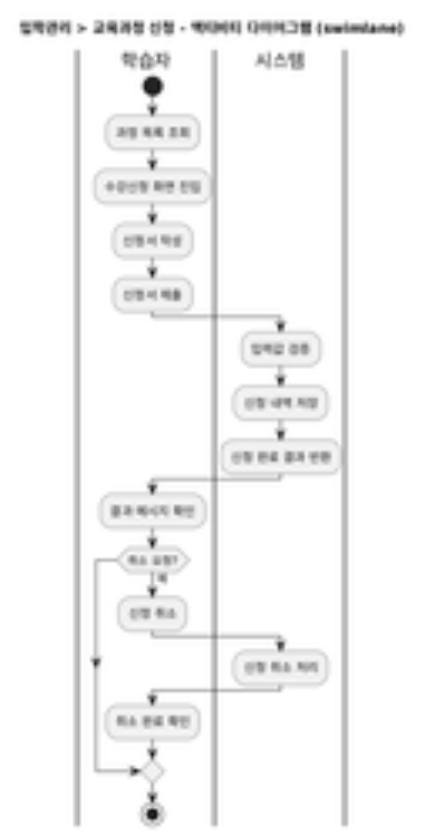

# **1. 분석 - 1. 비즈니스 정의서**
# **1.1. 비즈니스 액터 목록**

|**액터명**|**액터 설명**|**관련부서 (세분화)**|
| :- | :- | :- |
|학습자|교육과정을 신청하고 수강하는 주체. 대상은 선수, 지도자, 심판, 청소년, 일반체육인을 포함|교육복지부, 종목육성부(선수), 스포츠클럽부(지도자), 청소년체육부(청소년)|
|교수자|교육 콘텐츠를 제공하고, 학습자와 상호작용하며 교육을 수행하는 역할|교육복지부|
|강사|강의를 개설하고 강의 수행 및 수강생 평가에 참여하는 외부 또는 내부 강의자|교육복지부, 스포츠클럽부 (강사 자격 관리 시 협조)|
|운영자|학습운영시스템을 실질적으로 운영하고 교육과정 개설, 수강 관리, 콘텐츠 등록 등을 처리|교육복지부|
|관리자|시스템 메뉴, 권한, 통계, 코드 등 고급 기능을 설정하고 전체 운영을 총괄하는 내부 관리자|교육복지부, 스포츠정보화부 (시스템 연계 및 기술 설정 시)|
|시스템|외부 시스템(SPORTS 포털, 체육정보시스템 등)과 연동되어 데이터 송수신을 수행하는 비인간 주체|스포츠정보화부, 체육정보시스템 운영부서|
|인증기관|통합회원 가입 및 본인 인증 처리 등 외부 인증 서비스와 연계되는 주체|인사총무부, 스포츠정보화부|
|콘텐츠 제작자|학습 콘텐츠를 기획·제작·등록하는 주체. 내부 운영자 또는 외부 위탁사일 수 있음|교육복지부, 외주 콘텐츠 제작사|
# **2. 비즈니스 패키지 체계**

|**대분류**|**중분류**|**소분류**|**소분류 설명**|**관련근거 (요구사항 고유번호)**|
| :- | :- | :- | :- | :- |
|입학관리|접수관리|교육과정 신청|학습자가 과정 목록을 조회하고 수강신청을 수행하며, 신청 상태를 확인하고 취소할 수 있음|SFR-006​|
|회원관리|회원관리|통합회원가입|스포츠지원포털의 통합회원 체계에 기반한 가입 기능으로, ID 연계 및 계정 연동 포함|SFR-003, SIR-009​|
|회원관리|회원관리회원관리|본인인증|PASS, 공동인증서 등을 통한 외부 인증기관 연계 실명 확인 기능|SFR-003, SIR-009​|
|회원관리|회원관리회원관리|회원정보수정|회원 기본정보(연락처, 관심 분야 등) 수정 및 연동된 정보 갱신 처리|SFR-003​|
|교육운영|교육과정관리|프로그램 개설|교육 프로그램의 유형, 대상, 강의구성 등의 기초 정보 등록 및 관리|SFR-004​|
|교육운영|교육과정관리|강사지정|교육 과정에 강사 지정 및 배정 처리, 강사풀에서 선택하여 연결|SFR-004, SFR-014​|
|교육운영|교육과정관리|교육일정설정|차수 설정, 일시 등록, 강의장소 매핑을 통한 시간표 생성 기능|SFR-004​|
|교육운영|수강관리|수강신청|개설된 과정을 대상으로 수강 신청 및 신청 완료 여부 확인 기능|SFR-006​|
|교육운영|수강관리|이력조회|수강 이력, 이수 여부, 평가 기록 등 개인의 학습 이력을 종합 조회|SFR-007​|
|교육운영|수강관리|과정추천|학습자의 수강 이력, 관심 정보 등을 기반으로 유사 과정 자동 추천|SFR-006​|
|교육운영|수료관리|출결관리|출석 여부 기록, 진도율 체크, 출결 기준 충족 여부 확인 기능|SFR-010​|
|교육운영|수료관리|평가결과반영|시험/설문 등 평가 결과를 반영하여 이수 여부를 자동 판단 및 처리|SFR-010​|
|교육운영|수료관리|수료증발급|수료 조건 충족 시 수료증을 전자문서 형태로 자동 생성 및 다운로드 제공|SFR-007, SFR-010, SIR-012, SIR-013​|
|교육운영|평가관리|설문관리|교육 과정별 설문 등록, 응답 관리, 통계 분석, 미응답자 추적 발송 포함|SFR-009​|
|교육운영|평가관리|시험관리|시험 출제, 응시, 자동 채점, 결과 기록 등의 기능 포함|SFR-009​|
|교육운영|평가관리|평가통계|설문/시험 데이터를 기반으로 강사별, 과정별, 수강자별 통계 제공|SFR-013​|
|교육운영|일정관리|시간표 설정|과정별 차수 시간표를 설정하고, 일자/강의/강사/장소 매핑 기능 포함|SFR-004​|
|콘텐츠관리|콘텐츠등록|콘텐츠 업로드|교육용 콘텐츠 파일 등록, 영상/문서 파일 업로드 및 메타 정보 입력|SFR-003​|
|콘텐츠관리|콘텐츠등록|콘텐츠 수정|등록 콘텐츠에 대한 내용 수정, 재검수 및 승인 절차 지원|SFR-003​|
|콘텐츠관리|콘텐츠등록|콘텐츠 검수|콘텐츠 등록 후 검토 및 승인/반려 처리 기능|SFR-003​|
|콘텐츠관리|콘텐츠분류|과정유형/과목분류|교육 과정 및 과목 유형을 기준으로 유형, 분야, 단계별 분류 설정|SFR-003​|
|시설관리|시설정보관리|강의실 현황|강의실의 위치, 수용 인원, 사용 목적 등을 등록하여 관리|SFR-008​|
|시설관리|시설정보관리|위치정보|지도기반 위치 표기, 접근성 정보 및 강의실 편의시설 정보 제공|SFR-008​|
|시설관리|시설정보관리|이용안내|강의실 사용 가능 시간, 주의사항, 예약 유의사항 등 안내 제공|SFR-008​|
|시설관리|대관예약관리|대관신청|강의실 대관을 위한 일정 선택, 신청서 입력 기능 포함|SFR-008​|
|시설관리|대관예약관리|예약승인|관리자에 의한 대관 신청 승인 및 반려 처리 기능|SFR-008​|
|시설관리|대관예약관리|이용현황조회|시간대별, 날짜별 대관 신청 및 승인 현황 확인 기능|SFR-008​|
|포털관리|학습자포털|마이페이지|수강 내역, 신청 현황, 이수 증명 등 개인 학습 종합 정보 조회|SFR-007​|
|포털관리|강사지원포털|강사등록|강사의 자격 정보 입력 및 강사 신청 접수 기능|SFR-014​|
|포털관리|강사지원포털|이력조회|등록된 강사의 강의 이력, 평가 내역 등 열람|SFR-014​|
|포털관리|강사지원포털|승인처리|강사 신청 승인 및 보류 처리 기능|SFR-014​|
|포털관리|커뮤니티관리|공지사항/자료실|시스템 공지 등록, 자료 게시 및 다운로드 기능|SFR-012​|
|포털관리|커뮤니티관리|희망콘텐츠 신청|신규 콘텐츠 요청 제안서 작성 및 관리자 검토 프로세스 포함|SFR-012​|
|포털관리|커뮤니티관리|FAQ|자주 묻는 질문을 분류별로 등록 및 열람|SFR-012​|
|공통관리|시스템관리|메뉴/팝업/약관 관리|시스템 메뉴 설정, 접근권한 메뉴별 설정, 팝업 및 약관 등록 관리 기능|SFR-012​|
|공통관리|권한관리|권한설정, 승인요청|사용자 그룹별 기능 접근 제어, 승인 요청 및 처리 흐름 포함|SFR-012​|
|공통관리|코드관리|공통코드, 그룹코드|시스템 전반에서 사용되는 코드 및 그룹 코드 정리 기능 포함|SFR-012​|
|공통관리|메시지관리|SMS 발송, 이력|강의안내, 수강 알림 등을 위한 메시지 발송 및 이력 저장 기능|SFR-012​|
|통계분석|학습통계|수강/이수/참여통계|수강자 수, 이수율, 학습활동 참여율 등 통계 제공|SFR-013​|
|통계분석|강사통계|활동내역, 평가결과|강사의 강의 횟수, 평가점수, 설문결과 기반 통계 제공|SFR-013​|
|통계분석|과정통계|수강/매출/만족도|과정별 수강자 수, 만족도 평가, 유료과정 매출 통계|SFR-013​|
|정산관리|수강정산|결제, 환불, 정산내역|수강신청 결제, 환불 처리, 강사비 정산 및 회계 보고 기능|SFR-011​|
|연계관리|시스템연계|포털/체육정보/인증 연계|통합회원, 체육인정보, 수료증 등 외부 시스템과 연계 API 처리|SFR-014, SIR-009~SIR-013​|
# **3. 비즈니스 패키지 상세**
## **3.1. 입학관리**

|**비즈니스 패키지ID**|**대분류**|**중분류**|**소분류**|**비즈니스 패키지 설명**|**하위 절차**|**관련부서**|
| :- | :- | :- | :- | :- | :- | :- |
|BP001|입학관리|접수관리|교육과정 신청|학습자가 과정 목록을 조회하고 수강신청을 수행하며, 신청 상태를 확인하고 취소할 수 있음|과정 목록 조회, 수강 신청서 작성, 수강 신청 제출, 신청 상태 확인, 신청 취소|교육운영부 또는 입학관리부|
### **3.1.1. 입학관리 > 접수관리 > 교육과정 신청 (SFR-006)**

|**비즈니스 프로세스ID**|**하위 절차명명**|**비즈니스 프로세스 절차**|**비즈니스 절차 설명**|**액터**|
| :- | :- | :- | :- | :- |
|BP001-PR01|과정 목록 조회|사용자가 교육과정 포털에서 개설된 과정 목록을 탐색함|교육 대상, 기간, 분야 등에 따라 신청 가능한 교육과정을 확인함|학습자|
|BP001-PR02|수강신청서 작성|수강 신청 화면에 진입하여 신청서 항목을 입력함|성명, 연락처, 신청 과정 등의 필수 입력사항을 작성함|학습자|
|BP001-PR03|수강신청서 제출|신청 내용을 검토 후 신청서를 제출함|신청서가 저장되고, 신청 상태가 '제출 완료'로 변경됨|학습자|
|BP001-PR04|신청 내역 조회 및 확인|제출한 신청서를 마이페이지에서 조회하고 상태를 확인함|신청 상태(접수 완료, 대기 등)를 열람할 수 있음|학습자|
|BP001-PR05|수강신청 취소 요청|이미 신청된 과정을 사용자가 직접 취소함|취소 기한 내에는 신청을 철회할 수 있으며, 상태가 '취소'로 갱신됨|학습자애|
### **3.1.2. 비즈니스 프로세스 절차도**
 
## **3.2. 회원관리**
-----
### **3.2.1. 회원관리 > 회원관리 > 통합회원가입 (SFR-003, SIR-009)**

|**비즈니스 패키지ID**|**대분류**|**중분류**|**소분류**|**비즈니스 패키지 설명**|**하위 절차**|**관련부서**|
| :- | :- | :- | :- | :- | :- | :- |
|BP002|회원관리|회원관리|통합회원가입|다양한 사용자 유형(학습자, 강사, 관리자 등)에 대한 통합 회원가입 기능을 제공하며, 필수 정보 입력 및 약관 동의, 본인인증을 포함함|회원유형 선택, 기본정보 입력, 약관동의, 본인인증, 가입완료|교육복지부, 시스템운영부|
#### **비즈니스 프로세스 상세**

|**비즈니스 프로세스ID**|**하위 절차 명**|**비즈니스 프로세스 절차**|**비즈니스 절차 설명**|**액터**|
| :- | :- | :- | :- | :- |
|BP002-PR01|회원유형 선택|학습자, 강사, 관리자 등 사용자 유형을 선택함|사용자 유형별 가입 경로 및 입력 항목 분기됨|사용자|
|BP002-PR02|기본정보 입력|이름, 생년월일, 연락처, 이메일 등 기본정보를 입력|필수입력값 검증 및 유효성 확인 포함|사용자|
|BP002-PR03|약관 동의|개인정보 수집 및 이용에 대한 약관에 동의함|필수 및 선택 약관을 구분하여 사용자 동의 처리|사용자|
|BP002-PR04|본인인증|외부 인증기관을 통한 본인인증을 수행함|NICE, PASS 등과 연계된 실명/휴대폰 인증 처리|사용자, 인증기관|
|BP002-PR05|가입 완료|회원가입 완료 후 계정이 생성됨|가입완료 메시지 표시 및 로그인 안내|시스템|
### **3.2.2. 회원관리 > 본인인증 > 외부 인증기관 연계 (SFR-003, SIR-009)**

|**비즈니스 패키지ID**|**대분류**|**중분류**|**소분류**|**비즈니스 패키지 설명**|**하위 절차**|**관련부서**|
| :- | :- | :- | :- | :- | :- | :- |
|BP003|회원관리|본인인증|외부 인증기관 연계|회원가입, 정보변경, 계정 복구 등 사용자 식별이 필요한 상황에서 외부 본인확인기관을 연계하여 실명 인증을 수행함|인증기관 선택, 사용자 정보 입력, 인증 요청, 결과 검증, 인증 완료 처리|교육복지부, 시스템운영부|
#### **📌 비즈니스 프로세스 상세**

|**비즈니스 프로세스ID**|**하위 절차 명**|**비즈니스 프로세스 절차**|**비즈니스 절차 설명**|**액터**|
| :- | :- | :- | :- | :- |
|BP003-PR01|인증기관 선택|사용할 본인확인기관을 선택함|PASS, NICE, KISA 등 인증 방식 제공|사용자|
|BP003-PR02|사용자 정보 입력|인증기관에 필요한 정보를 입력함|이름, 생년월일, 휴대전화번호 등 실명 기반 정보 입력|사용자|
|BP003-PR03|인증 요청|외부 인증기관에 인증 요청을 보냄|API 방식으로 인증 요청 처리|시스템|
|BP003-PR04|결과 검증|응답된 결과값을 검증하여 성공 여부를 판단함|정상 여부, 응답코드, 고유 식별값 등 확인|시스템|
|BP003-PR05|인증 완료 처리|본인확인 완료 후 다음 절차로 전환함|회원가입/정보수정 등 후속 흐름으로 연결|시스템|
### **3.2.3. 회원관리 > 회원정보수정 > 정보 갱신 처리 (SFR-003)**

|**비즈니스 패키지ID**|**대분류**|**중분류**|**소분류**|**비즈니스 패키지 설명**|**하위 절차**|**관련부서**|
| :- | :- | :- | :- | :- | :- | :- |
|BP004|회원관리|회원정보수정|정보 갱신 처리|가입 완료 후 사용자가 자신의 개인정보(이메일, 연락처 등)를 수정하거나, 관리자에 의해 정보가 변경될 수 있도록 관리함|정보 조회, 수정 요청, 본인확인, 정보 수정 처리, 변경 이력 저장|교육복지부, 시스템운영부|
#### **📌 비즈니스 프로세스 상세**

|**비즈니스 프로세스ID**|**하위 절차 명**|**비즈니스 프로세스 절차**|**비즈니스 절차 설명**|**액터**|
| :- | :- | :- | :- | :- |
|BP004-PR01|정보 조회|현재 등록된 회원 정보를 조회함|마이페이지 또는 관리자 화면에서 기본정보 확인 가능|사용자, 관리자|
|BP004-PR02|수정 요청|사용자 또는 관리자가 정보 수정을 요청함|사용자 직접 수정 또는 관리자가 수정 승인 요청을 처리함|사용자, 관리자|
|BP004-PR03|본인확인|정보 변경 시 본인 여부를 확인함|민감정보(전화번호, 이메일 등) 변경 시 본인인증 요구 가능|사용자|
|BP004-PR04|정보 수정 처리|수정된 정보를 저장함|입력값 검증 후 DB에 저장 및 완료 처리|시스템|
|BP004-PR05|변경 이력 저장|수정 전후 정보를 이력으로 저장함|변경 내역은 감사 및 로그 추적을 위해 시스템에 자동 저장됨|시스템|
## **3.3. 교육운영**
-----
### **3.3.1. 교육운영 > 교육과정관리 > 프로그램 개설 (SFR-004)**

|**비즈니스 패키지ID**|**대분류**|**중분류**|**소분류**|**비즈니스 패키지 설명**|**하위 절차**|**관련부서**|
| :- | :- | :- | :- | :- | :- | :- |
|BP005|교육운영|교육과정관리|프로그램 개설|교육 프로그램의 유형, 대상, 차수, 일정, 장소, 요금 등을 포함하여 전체 과정 운영정보를 등록하고, 수정·폐지까지 일괄 관리함|과정 등록, 차수 설정, 일정 등록, 장소 연계, 요금 설정, 과정 폐지 처리|교육복지부|
#### **📌 비즈니스 프로세스 상세**

|**비즈니스 프로세스ID**|**하위 절차 명**|**비즈니스 프로세스 절차**|**비즈니스 절차 설명**|**액터**|
| :- | :- | :- | :- | :- |
|BP005-PR01|과정 등록|과정명, 교육유형, 운영부서 등 기초 정보를 입력함|온라인/오프라인/혼합 여부, 과정 설명 등 포함|운영자|
|BP005-PR02|차수 설정|기수 단위로 반복 교육을 위한 차수 정보를 설정함|수강정원, 운영기간 등 각 차수별 개별 관리 가능|운영자|
|BP005-PR03|일정 등록|교육일정(시작일, 종료일) 및 주간 시간표를 등록함|수업일, 요일, 시간 단위 일정 구성 가능|운영자|
|BP005-PR04|장소 연계|오프라인 강의의 경우 강의실을 차수에 매핑함|강의장 위치, 수용 가능 인원을 기준으로 강의장 배정|운영자|
|BP005-PR05|요금 설정|교육유형/차수별로 수강료를 설정함|할인 정책, 무료 과정 여부 포함하여 등록|운영자|
|BP005-PR06|과정 폐지 처리|운영 중인 교육과정을 종료 또는 폐지함|수강 신청자 유무에 따른 제한 사항 포함|운영자|
### **3.3.1. 교육운영 > 교육과정관리 > 강사 지정 (SFR-004, SFR-014)**

|**비즈니스 패키지ID**|**대분류**|**중분류**|**소분류**|**비즈니스 패키지 설명**|**하위 절차**|**관련부서**|
| :- | :- | :- | :- | :- | :- | :- |
|BP006|교육운영|교육과정관리|강사 지정|교육과정 개설 시 강사풀에 등록된 강사 중 적합한 강사를 검색, 지정 및 배정하고, 이력 및 평가 정보를 연계함|강사 검색, 강사 지정, 강사 배정, 배정 변경 및 취소|교육복지부|
#### **📌 비즈니스 프로세스 상세**

|**비즈니스 프로세스ID**|**하위 절차 명**|**비즈니스 프로세스 절차**|**비즈니스 절차 설명**|**액터**|
| :- | :- | :- | :- | :- |
|BP006-PR01|강사 검색|강사풀 내 등록된 강사 중 조건에 맞는 강사를 검색함|자격, 분야, 평가 점수 등으로 검색 가능|운영자|
|BP006-PR02|강사 지정|검색된 강사 중 해당 과정에 적합한 강사를 선택함|강사 이력, 분야, 강의 가능 여부 등 확인 후 지정|운영자|
|BP006-PR03|강사 배정|교육 차수별로 지정된 강사를 배정함|강사별로 일정과 차수에 맞춰 자동 또는 수동 배정 가능|운영자|
|BP006-PR04|배정 변경 및 취소|배정된 강사를 교체하거나 배정을 해제함|변경 사유 등록 및 승인 절차 포함|운영자|
### **3.3.1. 교육운영 > 교육과정관리 > 교육일정 설정 (SFR-004)**

|**비즈니스 패키지ID**|**대분류**|**중분류**|**소분류**|**비즈니스 패키지 설명**|**하위 절차**|**관련부서**|
| :- | :- | :- | :- | :- | :- | :- |
|BP007|교육운영|교육과정관리|교육일정 설정|과정 차수별로 교육 일정을 설정하고, 시간표를 생성하며, 강의 장소와 매핑함으로써 실제 운영 가능한 일정을 구성함|차수 등록, 일정 등록, 시간표 생성, 강의장소 매핑|교육복지부|
#### **📌 비즈니스 프로세스 상세**

|**비즈니스 프로세스ID**|**하위 절차 명**|**비즈니스 프로세스 절차**|**비즈니스 절차 설명**|**액터**|
| :- | :- | :- | :- | :- |
|BP007-PR01|차수 등록|반복 교육 운영을 위한 차수 정보를 생성함|교육과정 단위 반복 운영을 위한 기수/차수 정보 등록 및 관리|운영자|
|BP007-PR02|일정 등록|교육 시작일, 종료일, 수업 요일, 시간 등을 설정함|차수별 수업 일정 및 수업 일수를 기준으로 기간과 시간대 구성|운영자|
|BP007-PR03|시간표 생성|일정과 강의 내용, 강사 매핑을 통해 시간표를 생성함|교육과정 내 강의별 시간대별 배정 시간표를 생성하고 편성|운영자|
|BP007-PR04|강의장소 매핑|각 일정별로 실제 강의장 정보를 연계함|오프라인 교육 시 강의실(장소) 정보와 차수 일정을 연결|운영자|
### **3.3.1. 교육운영 > 교육과정관리 > 과정정보 연계 (SIR-010)**

|**비즈니스 패키지ID**|**대분류**|**중분류**|**소분류**|**비즈니스 패키지 설명**|**하위 절차**|**관련부서**|
| :- | :- | :- | :- | :- | :- | :- |
|BP008|교육운영|교육과정관리|과정정보 연계|학습관리시스템(LMS)에 등록된 교육과정 정보를 스포츠지원포털에서 실시간으로 조회할 수 있도록 외부 연계 API를 통해 정보 송수신을 처리함|연계 항목 정의, 데이터 필터링 처리, 실시간 송신, 연계결과 검증|스포츠정보화부, 교육복지부|
#### **📌 비즈니스 프로세스 상세**

|**비즈니스 프로세스ID**|**하위 절차 명**|**비즈니스 프로세스 절차**|**비즈니스 절차 설명**|**액터**|
| :- | :- | :- | :- | :- |
|BP008-PR01|연계 항목 정의|외부 시스템에 연계할 과정 정보 항목을 정의함|교육명, 교육기간, 회차정보, 교육방식, 교육대상, 교육카테고리, 수료여부 등 포함|운영자(교육복지부)|
|BP008-PR02|데이터 필터링 처리|검색 조건에 따른 연계 대상 자료를 필터링함|포털에서 조회 가능한 조건으로 사전 필터 적용|시스템|
|BP008-PR03|실시간 송신|필터링된 과정 데이터를 외부 시스템으로 실시간 송신함|API 호출 방식으로 교육과정 정보를 실시간 전송|시스템|
|BP008-PR04|연계결과 검증|전송 결과를 수신 시스템 응답을 통해 검증함|정상 수신 여부, 응답 코드, 오류 발생 여부 확인|시스템|
### **3.3.1. 교육운영 > 교육과정관리 > 콘텐츠 등록 (SFR-003)**

|**비즈니스 패키지ID**|**대분류**|**중분류**|**소분류**|**비즈니스 패키지 설명**|**하위 절차**|**관련부서**|
| :- | :- | :- | :- | :- | :- | :- |
|BP009|교육운영|교육과정관리|콘텐츠 등록|교육용 콘텐츠 파일(문서, 동영상 등)을 등록하고, 메타정보를 입력하여 과정과 연계 가능하도록 관리함. 콘텐츠 등록 이후 검수 및 승인 절차 포함|콘텐츠 업로드, 메타정보 입력, 콘텐츠 검수, 콘텐츠 승인/반려|교육복지부, 외주 콘텐츠 제작사|
#### **📌 비즈니스 프로세스 상세**

|**비즈니스 프로세스ID**|**하위 절차 명**|**비즈니스 프로세스 절차**|**비즈니스 절차 설명**|**액터**|
| :- | :- | :- | :- | :- |
|BP009-PR01|콘텐츠 업로드|콘텐츠 파일(문서, 영상 등)을 업로드함|교육자료 파일을 첨부하고 형식 및 용량 기준 확인|콘텐츠 제작자 (외주 포함)|
|BP009-PR02|메타정보 입력|콘텐츠의 제목, 설명, 키워드, 분류 등을 입력함|검색과 연계 및 과정 매핑을 위한 주요 속성 입력|콘텐츠 제작자|
|BP009-PR03|콘텐츠 검수|등록된 콘텐츠에 대해 관리자 검수 절차 수행|내용의 적절성, 저작권, 품질기준 등 검토 후 승인 또는 반려 처리|운영자 (교육복지부)|
|BP009-PR04|콘텐츠 승인/반려|검수 결과에 따라 콘텐츠를 승인하거나 반려함|승인된 콘텐츠는 과정과 연결 가능, 반려 시 수정 요청 가능|운영자|
### **3.3.1. 교육운영 > 교육과정관리 > 콘텐츠연계 (SFR-012)**

|**비즈니스 패키지ID**|**대분류**|**중분류**|**소분류**|**비즈니스 패키지 설명**|**하위 절차**|**관련부서**|
| :- | :- | :- | :- | :- | :- | :- |
|BP010|교육운영|교육과정관리|콘텐츠연계|외부 기관 또는 사용자로부터 신청된 콘텐츠를 교육과정과 연계할 수 있도록 콘텐츠 요청, 제안서 검토 및 관리자 승인 흐름을 관리함|콘텐츠 신청 접수, 제안서 등록, 검토 및 승인, 과정과 연계|교육복지부, 콘텐츠제안자(사용자/제작사)|
#### **📌 비즈니스 프로세스 상세**

|**비즈니스 프로세스ID**|**하위 절차 명**|**비즈니스 프로세스 절차**|**비즈니스 절차 설명**|**액터**|
| :- | :- | :- | :- | :- |
|BP010-PR01|콘텐츠 신청 접수|신규 콘텐츠 등록을 요청하기 위해 신청서를 제출함|사용자 또는 제작자가 콘텐츠 활용 요청을 제출|콘텐츠제안자|
|BP010-PR02|제안서 등록|콘텐츠에 대한 상세 제안서를 등록함|콘텐츠의 목적, 대상, 형식, 기대 효과 등을 기술한 문서 등록|콘텐츠제안자|
|BP010-PR03|검토 및 승인|콘텐츠 제안 내용을 검토하고 승인 또는 반려함|관리자는 내용의 적정성, 중복성, 수요 등을 검토하여 결과 결정|교육복지부|
|BP010-PR04|과정과 연계|승인된 콘텐츠를 특정 교육과정에 연계함|교육과정별 콘텐츠 구성 요소로 연계되며 이후 콘텐츠 등록 절차로 연결됨|교육복지부|
### **3.4.1. 수강관리 > 수강신청 > 수강신청 (SFR-006)**

|**비즈니스 패키지ID**|**대분류**|**중분류**|**소분류**|**비즈니스 패키지 설명**|**하위 절차**|**관련부서**|
| :- | :- | :- | :- | :- | :- | :- |
|BP011|수강관리|수강신청|수강신청|학습자가 개설된 교육과정에 대해 수강 신청을 수행하고, 신청 내역을 확인하거나 신청을 취소할 수 있도록 관리함|과정 목록 조회, 수강신청서 작성, 신청서 제출, 신청 내역 확인, 수강신청 취소|교육운영부 또는 입학관리부|
#### **📌 비즈니스 프로세스 상세**

|**비즈니스 프로세스ID**|**하위 절차 명**|**비즈니스 프로세스 절차**|**비즈니스 절차 설명**|**액터**|
| :- | :- | :- | :- | :- |
|BP011-PR01|과정 목록 조회|개설된 교육과정 목록을 탐색하고 선택함|교육 대상, 기간, 분야 등에 따라 필터링 가능|학습자|
|BP011-PR02|수강신청서 작성|수강신청서 양식에 따라 정보를 입력함|성명, 연락처, 신청 과정, 단체 여부 등 필수 정보 작성|학습자|
|BP011-PR03|신청서 제출|신청서 검토 후 시스템에 제출함|저장 완료 후 신청 상태는 '제출 완료'로 변경됨|학습자|
|BP011-PR04|신청 내역 확인|제출된 신청서를 마이페이지에서 조회함|상태(접수 완료/대기 등)를 확인 가능|학습자|
|BP011-PR05|수강신청 취소|이미 제출한 신청서를 취소함|정해진 기간 내에는 수강신청 철회 가능, 상태는 '취소'로 갱신됨|학습자|
### **3.4.2. 수강관리 > 이력조회 > 학습 이력 관리 (SFR-007)**

|**비즈니스 패키지ID**|**대분류**|**중분류**|**소분류**|**비즈니스 패키지 설명**|**하위 절차**|**관련부서**|
| :- | :- | :- | :- | :- | :- | :- |
|BP012|수강관리|이력조회|학습 이력 관리|학습자의 수강 이력, 학습 중단 여부, 평가 결과, 수료 여부 등 개인 학습활동 내역을 통합 조회함|이력 정보 수집, 개인 학습 이력 조회, 이력 기반 통계 제공|교육운영부 또는 입학관리부|
#### **📌 비즈니스 프로세스 상세**

|**비즈니스 프로세스ID**|**하위 절차 명**|**비즈니스 프로세스 절차**|**비즈니스 절차 설명**|**액터**|
| :- | :- | :- | :- | :- |
|BP012-PR01|이력 정보 수집|학습자의 수강 과정, 학습 상태, 평가 결과 등을 시스템에 수집함|수강 신청, 학습 활동, 설문/시험 결과, 출석 여부 등 이력을 실시간으로 수집|시스템|
|BP012-PR02|개인 학습 이력 조회|마이페이지에서 개인별 학습 활동 이력을 조회함|수강 상태(신청/학습중/수료/중단 등)와 평가 결과를 통합 확인 가능|학습자|
|BP012-PR03|이력 기반 통계 제공|개인별 이력을 기반으로 통계 수치를 제공함|학습완료율, 누적 수강시간, 이수율 등 개인화된 학습 대시보드 구성|시스템|
### **3.4.3. 수강관리 > 과정추천 > 개인 맞춤 추천 (SFR-006)**

|**비즈니스 패키지ID**|**대분류**|**중분류**|**소분류**|**비즈니스 패키지 설명**|**하위 절차**|**관련부서**|
| :- | :- | :- | :- | :- | :- | :- |
|BP013|수강관리|과정추천|개인 맞춤 추천|학습자의 관심 분야, 과거 수강 이력, 활동 데이터를 기반으로 유사한 교육과정을 자동 추천하고, 맞춤형 과정 목록을 제공함|관심 정보 등록, 유사도 기반 추천, 추천 목록 출력, 수강 연결|교육운영부|
#### **📌 비즈니스 프로세스 상세**

|**비즈니스 프로세스ID**|**하위 절차 명**|**비즈니스 프로세스 절차**|**비즈니스 절차 설명**|**액터**|
| :- | :- | :- | :- | :- |
|BP013-PR01|관심 정보 등록|학습자가 마이페이지에서 관심 분야를 등록하거나 수정함|직무, 교육 분야, 자격 분야, 학습 목적 등을 선택|학습자|
|BP013-PR02|유사도 기반 추천|시스템이 관심정보 및 과거 수강이력을 바탕으로 추천 목록을 구성함|알고리즘 또는 룰기반으로 유사도/적합도 평가를 통해 유사 과정 매칭|시스템|
|BP013-PR03|추천 목록 출력|추천된 과정 목록을 마이페이지 또는 추천탭에 출력함|추천 우선순위 기준으로 정렬된 리스트 형태로 제공|시스템|
|BP013-PR04|수강 연결|추천된 과정을 클릭 시 수강신청 화면으로 연계됨|추천에서 직접 수강신청으로 연계되는 사용자 흐름|학습자|
### **3.5.1. 수료관리 > 출결관리 > 출석 및 진도율 관리 (SFR-010)**

|**비즈니스 패키지ID**|**대분류**|**중분류**|**소분류**|**비즈니스 패키지 설명**|**하위 절차**|**관련부서**|
| :- | :- | :- | :- | :- | :- | :- |
|BP014|수료관리|출결관리|출석 및 진도율 관리|학습자의 출석 여부 및 온라인 콘텐츠의 진도율을 기록하고, 수료 기준 충족 여부를 판단하기 위한 데이터를 관리함|출석부 등록, 출결 입력, 진도율 계산, 수료 기준 판단|교육복지부|
#### **📌 비즈니스 프로세스 상세**

|**비즈니스 프로세스ID**|**하위 절차 명**|**비즈니스 프로세스 절차**|**비즈니스 절차 설명**|**액터**|
| :- | :- | :- | :- | :- |
|BP014-PR01|출석부 등록|각 과정의 교육 일정에 따라 출석부를 생성함|오프라인 강의 기준으로 강의일자별 출석 대상자 목록 구성|운영자|
|BP014-PR02|출결 입력|수강자의 출석 여부를 수동 또는 자동으로 입력함|출석, 지각, 조퇴, 결석 등의 상태로 입력되며, 관리자 또는 강사에 의해 처리됨|운영자, 강사|
|BP014-PR03|진도율 계산|온라인 콘텐츠 학습 이력을 기반으로 진도율을 계산함|콘텐츠 단위별 재생 시간, 완료 여부 등을 기준으로 자동 산정|시스템|
|BP014-PR04|수료 기준 판단|출결 및 진도율 정보로 수료 여부를 판별함|수료 기준(출석률 %, 진도율 %) 만족 여부를 종합하여 수료 처리로 연계됨|시스템|
### **3.5.2. 수료관리 > 평가결과반영 > 이수 판정 (SFR-010)**

|**비즈니스 패키지ID**|**대분류**|**중분류**|**소분류**|**비즈니스 패키지 설명**|**하위 절차**|**관련부서**|
| :- | :- | :- | :- | :- | :- | :- |
|BP015|수료관리|평가결과반영|이수 판정|시험/설문/진도율 등 교육평가 결과를 기준으로 수료 여부를 자동 판단하고, 이수 결과를 저장 및 활용함|평가항목 설정, 결과 수집, 이수 조건 검증, 이수 처리|교육복지부|
#### **📌 비즈니스 프로세스 상세**

|**비즈니스 프로세스ID**|**하위 절차 명**|**비즈니스 프로세스 절차**|**비즈니스 절차 설명**|**액터**|
| :- | :- | :- | :- | :- |
|BP015-PR01|평가항목 설정|교육과정에 따라 수료판정에 활용될 평가 항목을 지정함|시험, 설문, 진도율, 출결 등 포함 가능|운영자|
|BP015-PR02|결과 수집|학습자의 시험점수, 설문응답 결과, 진도율 등을 수집함|시스템으로부터 자동 연계 또는 강사/운영자가 입력|시스템, 운영자|
|BP015-PR03|이수 조건 검증|수료기준에 따라 수강생의 평가 결과를 검증함|항목별 기준값(예: 시험 60점 이상, 진도율 80% 이상) 만족 여부 확인|시스템|
|BP015-PR04|이수 처리|기준 충족 시 이수자로 처리하고 상태를 갱신함|이수 여부는 수료증 발급 및 이수자 통계로 연계됨|시스템|
### **3.5.3. 수료관리 > 수료증발급 > 수료증 생성 및 연계 (SFR-007, SFR-010, SIR-012, SIR-013)**

|**비즈니스 패키지ID**|**대분류**|**중분류**|**소분류**|**비즈니스 패키지 설명**|**하위 절차**|**관련부서**|
| :- | :- | :- | :- | :- | :- | :- |
|BP016|수료관리|수료증발급|수료증 생성 및 연계|수료 조건을 충족한 학습자에 대해 전자 수료증을 자동으로 생성하고, 발급 이력 및 외부 포털 시스템과 연계하여 수료증 정보를 처리함|수료증 생성, 수료증 조회, 수기 발급 신청, 포털 연계, 발급 이력 등록|교육복지부, 스포츠정보화부|
#### **📌 비즈니스 프로세스 상세**

|**비즈니스 프로세스ID**|**하위 절차 명**|**비즈니스 프로세스 절차**|**비즈니스 절차 설명**|**액터**|
| :- | :- | :- | :- | :- |
|BP016-PR01|수료증 생성|이수 판정 완료된 학습자에 대해 전자 수료증을 자동 생성함|수료증 양식, 교육명, 수료일자, 성명 등 포함된 PDF 형태 수료증 생성|시스템|
|BP016-PR02|수료증 조회|마이페이지 등에서 수료증을 조회하거나 다운로드함|로그인 기반 사용자 본인 확인 후 수료증 목록 및 상세 확인 가능|학습자|
|BP016-PR03|수기 발급 신청|증명 용도로 별도 수료증 신청 시 신청서를 제출함|발급 용도, 부수, 인적 정보 포함한 신청 정보 생성 및 승인 요청|학습자|
|BP016-PR04|포털 연계|수료증 발급 정보를 스포츠지원포털과 연계함|신청정보(SIR-012) 및 발급이력(SIR-013)을 실시간 API 연계로 송수신|시스템|
|BP016-PR05|발급 이력 등록|모든 수료증 발급 이력을 시스템에 저장하고 추후 열람 가능하도록 함|수료증 ID, 발급 일시, 출력 여부, 승인 여부, 포털 전송 여부 포함|시스템|
## **3.6. 교육운영 > 평가관리**
-----
### **3.6.1. 교육운영 > 평가관리 > 설문관리 (SFR-009)**

|**비즈니스 패키지ID**|**대분류**|**중분류**|**소분류**|**비즈니스 패키지 설명**|**하위 비즈니스 프로세스명**|**관련부서**|
| :- | :- | :- | :- | :- | :- | :- |
|BP016|교육운영|평가관리|설문관리|교육 과정별 설문 등록, 응답 관리, 통계 분석, 미응답자 추적 발송까지의 전 과정을 관리함|설문 등록, 응답 수집, 통계 분석, 미응답자 재발송|교육복지부|
#### **📌 비즈니스 프로세스 상세**

|**비즈니스 프로세스ID**|**비즈니스 프로세스명**|**비즈니스 프로세스 절차**|**비즈니스 절차 설명**|**액터**|
| :- | :- | :- | :- | :- |
|BP016-PR01|설문 등록|과정별 설문 문항을 등록함|강사·강의·시설 등에 대해 사전 등록된 문항 및 사용자 정의 문항 입력|운영자|
|BP016-PR02|응답 수집|수강자 응답을 수집함|모바일/웹을 통해 주관식, 객관식, OX 등의 다양한 유형으로 응답 수집|학습자|
|BP016-PR03|통계 분석|응답 결과를 분석함|강사평가, 강의만족도, 시설 평가 등 설문 결과 기반 통계 산출|시스템|
|BP016-PR04|미응답자 재발송|미응답 대상자에게 재알림 전송|설문 마감 이전 미응답 대상에게 자동/수동으로 알림 메시지를 재발송|시스템|
### **3.6.2. 교육운영 > 평가관리 > 시험관리 (SFR-009)**

|**비즈니스 패키지ID**|**대분류**|**중분류**|**소분류**|**비즈니스 패키지 설명**|**하위 비즈니스 프로세스명**|**관련부서**|
| :- | :- | :- | :- | :- | :- | :- |
|BP017|교육운영|평가관리|시험관리|교육 과정별 시험 출제, 응시, 채점, 결과 기록 등 시험 운영 기능 전반을 관리함|시험 등록, 시험 응시, 자동 채점, 시험 결과 기록|교육복지부|
#### **📌 비즈니스 프로세스 상세**

|**비즈니스 프로세스ID**|**비즈니스 프로세스명**|**비즈니스 프로세스 절차**|**비즈니스 절차 설명**|**액터**|
| :- | :- | :- | :- | :- |
|BP017-PR01|시험 등록|시험 문제를 등록함|객관식, 주관식 문제 유형 설정 및 정답/배점/해설 등을 설정함|운영자|
|BP017-PR02|시험 응시|수강자가 시험에 응시함|시스템 로그인 후 각 시험 응시 페이지에서 시험에 참여함|학습자|
|BP017-PR03|자동 채점|시험 결과를 자동 채점함|사전에 설정된 정답과 비교하여 자동으로 점수를 계산함|시스템|
|BP017-PR04|시험 결과 기록|채점 결과를 기록하고 저장함|점수, 응답 내역, 응시 시간 등을 데이터베이스에 저장함|시스템|
### **3.6.3. 교육운영 > 평가관리 > 평가통계 (SFR-013)**

|**비즈니스 패키지ID**|**대분류**|**중분류**|**소분류**|**비즈니스 패키지 설명**|**하위 비즈니스 프로세스명**|**관련부서**|
| :- | :- | :- | :- | :- | :- | :- |
|BP018|교육운영|평가관리|평가통계|설문 및 시험 데이터를 기반으로 강사, 과정, 수강자별 주요 평가 통계를 분석 및 시각화함|평가 데이터 수집, 통계 기준 설정, 통계 분석, 통계 리포트 제공|교육복지부|
#### **📌 비즈니스 프로세스 상세**

|**비즈니스 프로세스ID**|**비즈니스 프로세스명**|**비즈니스 프로세스 절차**|**비즈니스 절차 설명**|**액터**|
| :- | :- | :- | :- | :- |
|BP018-PR01|평가 데이터 수집|설문 및 시험 결과 데이터를 수집|강좌, 강사, 수강자 단위로 설문 및 시험 응답, 점수 데이터를 통합 수집|시스템|
|BP018-PR02|통계 기준 설정|분석 기준을 정의|기간, 유형, 대상별로 통계 기준을 설정하여 분석 시 일관성 확보|운영자|
|BP018-PR03|통계 분석|지표별 분석 수행|만족도 평균, 이수율, 시험 평균점수, 응답률 등을 기준으로 통계 분석 수행|시스템|
|BP018-PR04|통계 리포트 제공|결과 리포트를 생성 및 제공|분석 결과를 그래프/표 형태로 관리자에게 제공. 화면 출력 또는 PDF 리포트 형태 가능|시스템, 운영자|
### **3.6.4. 교육운영 > 일정관리 > 시간표 설정 (SFR-004)**

|**비즈니스 패키지ID**|**대분류**|**중분류**|**소분류**|**비즈니스 패키지 설명**|**하위 비즈니스 프로세스명**|**관련부서**|
| :- | :- | :- | :- | :- | :- | :- |
|BP019|교육운영|일정관리|시간표 설정|교육 과정별 차수 및 일정 정보를 바탕으로 시간표를 설정하고, 강의/강사/장소를 매핑하여 운영 일정을 체계적으로 구성함|차수 생성, 강의 배정, 강사 매핑, 강의실 매핑, 시간표 조회 및 수정|교육복지부|
#### **📌 비즈니스 프로세스 상세**

|**비즈니스 프로세스ID**|**비즈니스 프로세스명**|**비즈니스 프로세스 절차**|**비즈니스 절차 설명**|**액터**|
| :- | :- | :- | :- | :- |
|BP019-PR01|차수 생성|과정별 차수를 생성|교육과정의 반복 운영을 위해 각 차수를 구분하여 생성함|운영자|
|BP019-PR02|강의 배정|차수 내 강의 일정을 설정함|요일/시간 단위로 강의 세션을 배정하고 주차별 일정을 구성함|운영자|
|BP019-PR03|강사 매핑|강의에 강사를 연결함|강사 풀 또는 외부 등록 강사 중 선택하여 강의별로 지정함|운영자|
|BP019-PR04|강의실 매핑|오프라인 강의실을 연결함|수용 인원, 위치 등을 고려하여 강의실을 선택하고 배정함|운영자|
|BP019-PR05|시간표 조회 및 수정|설정된 시간표를 조회/수정함|시간표 구성 결과를 시각적으로 확인하고 필요 시 일정 변경 또는 수정 가능|운영자|
### **3.7.1. 콘텐츠관리 > 콘텐츠등록 > 콘텐츠 업로드 (SFR-003)**

|**비즈니스 패키지ID**|**대분류**|**중분류**|**소분류**|**비즈니스 패키지 설명**|**하위 비즈니스 프로세스명**|**관련부서**|
| :- | :- | :- | :- | :- | :- | :- |
|BP020|콘텐츠관리|콘텐츠등록|콘텐츠 업로드|교육과정에 사용할 콘텐츠 파일(영상, 문서 등)을 등록하고, 학습 메타 정보와 함께 시스템에 업로드함|콘텐츠 파일 등록, 메타정보 입력, 콘텐츠 저장 및 적용|교육복지부, 외부 콘텐츠 제작사|
#### **📌 비즈니스 프로세스 상세**

|**비즈니스 프로세스ID**|**비즈니스 프로세스명**|**비즈니스 프로세스 절차**|**비즈니스 절차 설명**|**액터**|
| :- | :- | :- | :- | :- |
|BP020-PR01|콘텐츠 파일 등록|영상/문서 콘텐츠 파일 업로드|교육용 콘텐츠 파일(mp4, pdf 등)을 파일 브라우저 또는 드래그앤드롭으로 시스템에 업로드함|콘텐츠 제작자, 운영자|
|BP020-PR02|메타정보 입력|콘텐츠 관련 정보 입력|콘텐츠 제목, 설명, 강의시간, 사용범위, 버전, 과정 연계 등 메타 정보를 입력함|콘텐츠 제작자, 운영자|
|BP020-PR03|콘텐츠 저장 및 적용|콘텐츠 저장 및 시스템 반영|등록된 콘텐츠를 저장하고, 교육과정/강의와 연결하여 실사용 가능하도록 적용함|시스템|
## **3.7. 콘텐츠관리**
-----
### **3.7.1. 콘텐츠관리 > 콘텐츠등록 > 콘텐츠 업로드 (SFR-003)**

|**비즈니스 패키지ID**|**대분류**|**중분류**|**소분류**|**비즈니스 패키지 설명**|**하위 비즈니스 프로세스명**|**관련부서**|
| :- | :- | :- | :- | :- | :- | :- |
|BP021|콘텐츠관리|콘텐츠등록|콘텐츠 업로드|교육과정에 사용할 콘텐츠 파일(영상, 문서 등)을 등록하고, 학습 메타 정보와 함께 시스템에 업로드함|콘텐츠 파일 등록, 메타정보 입력, 콘텐츠 저장 및 적용|교육복지부, 외부 콘텐츠 제작사|

|**비즈니스 프로세스ID**|**비즈니스 프로세스명**|**비즈니스 프로세스 절차**|**비즈니스 절차 설명**|**액터**|
| :- | :- | :- | :- | :- |
|BP021-PR01|콘텐츠 파일 등록|영상/문서 콘텐츠 파일 업로드|교육용 콘텐츠 파일(mp4, pdf 등)을 파일 브라우저 또는 드래그앤드롭으로 시스템에 업로드함|콘텐츠 제작자, 운영자|
|BP021-PR02|메타정보 입력|콘텐츠 관련 정보 입력|콘텐츠 제목, 설명, 강의시간, 사용범위, 버전, 과정 연계 등 메타 정보를 입력함|콘텐츠 제작자, 운영자|
|BP021-PR03|콘텐츠 저장 및 적용|콘텐츠 저장 및 시스템 반영|등록된 콘텐츠를 저장하고, 교육과정/강의와 연결하여 실사용 가능하도록 적용함|시스템|

-----
### **3.7.2. 콘텐츠관리 > 콘텐츠등록 > 콘텐츠 수정 (SFR-003)**

|**비즈니스 패키지ID**|**대분류**|**중분류**|**소분류**|**비즈니스 패키지 설명**|**하위 비즈니스 프로세스명**|**관련부서**|
| :- | :- | :- | :- | :- | :- | :- |
|BP022|콘텐츠관리|콘텐츠등록|콘텐츠 수정|기존에 등록된 콘텐츠의 내용, 메타정보, 버전 등을 수정하고, 재검수 및 재적용하는 과정을 관리함|콘텐츠 검색, 수정 요청, 수정 반영 및 검수|교육복지부, 외부 콘텐츠 제작사|

|**비즈니스 프로세스ID**|**비즈니스 프로세스명**|**비즈니스 프로세스 절차**|**비즈니스 절차 설명**|**액터**|
| :- | :- | :- | :- | :- |
|BP022-PR01|콘텐츠 검색|수정 대상 콘텐츠 조회|기존에 등록된 콘텐츠를 제목, 과정명, 업로드일 기준으로 검색함|운영자|
|BP022-PR02|수정 요청|콘텐츠 수정 내용 입력|콘텐츠 설명, 메타 정보, 파일 내용 등을 일부 변경하고 수정 요청을 등록함|콘텐츠 제작자|
|BP022-PR03|수정 반영 및 검수|수정된 콘텐츠 반영|수정 내용을 적용한 후 재검수하여 적용 여부를 판단|운영자, 시스템|

-----
### **3.7.3. 콘텐츠관리 > 콘텐츠등록 > 콘텐츠 검수 (SFR-003)**

|**비즈니스 패키지ID**|**대분류**|**중분류**|**소분류**|**비즈니스 패키지 설명**|**하위 비즈니스 프로세스명**|**관련부서**|
| :- | :- | :- | :- | :- | :- | :- |
|BP023|콘텐츠관리|콘텐츠등록|콘텐츠 검수|등록된 콘텐츠의 품질, 내용, 저작권 여부 등을 검토하고 승인 또는 반려를 결정함|콘텐츠 목록 조회, 검토, 승인/반려|교육복지부|

|**비즈니스 프로세스ID**|**비즈니스 프로세스명**|**비즈니스 프로세스 절차**|**비즈니스 절차 설명**|**액터**|
| :- | :- | :- | :- | :- |
|BP023-PR01|콘텐츠 목록 조회|검토 대상 콘텐츠 목록 조회|승인 대기 상태의 콘텐츠 리스트를 조회함|운영자|
|BP023-PR02|콘텐츠 검토|콘텐츠 내용 및 품질 검토|구성 적절성, 저작권, 교육 목적 부합 여부 등을 기준으로 검토함|운영자|
|BP023-PR03|승인/반려 처리|승인 또는 반려 결정|적합한 콘텐츠는 승인하고, 보완이 필요한 경우 반려 처리함|운영자|

-----
### **3.7.4. 콘텐츠관리 > 콘텐츠분류 > 과정유형/과목분류 (SFR-003)**

|**비즈니스 패키지ID**|**대분류**|**중분류**|**소분류**|**비즈니스 패키지 설명**|**하위 비즈니스 프로세스명**|**관련부서**|
| :- | :- | :- | :- | :- | :- | :- |
|BP024|콘텐츠관리|콘텐츠분류|과정유형/과목분류|교육과정 및 콘텐츠를 유형, 분야, 수준, 대상 등 기준으로 분류하고 관리함|분류 기준 설정, 분류 항목 등록 및 관리|교육복지부|

|**비즈니스 프로세스ID**|**비즈니스 프로세스명**|**비즈니스 프로세스 절차**|**비즈니스 절차 설명**|**액터**|
| :- | :- | :- | :- | :- |
|BP024-PR01|분류 기준 설정|분류 체계 기준 설정|유형(기초/심화 등), 분야(지도자/심판 등), 대상별로 분류 기준을 정의함|운영자|
|BP024-PR02|분류 항목 등록 및 관리|분류 정보 등록 및 수정|설정된 기준에 따라 항목을 등록하고 필요 시 수정/삭제 관리함|운영자|
## **3.8. 시설관리**
-----
### **3.8.1. 시설관리 > 시설정보관리 > 강의실 현황 (SFR-008)**

|**비즈니스 패키지ID**|**대분류**|**중분류**|**소분류**|**비즈니스 패키지 설명**|**하위 비즈니스 프로세스명**|**관련부서**|
| :- | :- | :- | :- | :- | :- | :- |
|BP025|시설관리|시설정보관리|강의실 현황|교육에 활용되는 강의실 정보를 등록하고, 위치·수용 인원·사용 용도 등의 정보를 관리함|강의실 등록, 정보 조회, 수정 및 삭제|교육복지부|

|**비즈니스 프로세스ID**|**비즈니스 프로세스명**|**비즈니스 프로세스 절차**|**비즈니스 절차 설명**|**액터**|
| :- | :- | :- | :- | :- |
|BP025-PR01|강의실 등록|강의실 정보 입력|강의실명, 위치, 수용 인원, 용도 등 강의실 기초정보를 등록함|운영자|
|BP025-PR02|강의실 정보 조회|등록된 강의실 조회|등록된 강의실 목록을 조회하고 상세정보 확인 가능|운영자|
|BP025-PR03|강의실 정보 수정/삭제|강의실 정보 변경 또는 삭제|기존 정보 수정 및 사용 종료 시 삭제 처리|운영자|

-----
### **3.8.2. 시설관리 > 시설정보관리 > 위치정보 (SFR-008)**

|**비즈니스 패키지ID**|**대분류**|**중분류**|**소분류**|**비즈니스 패키지 설명**|**하위 비즈니스 프로세스명**|**관련부서**|
| :- | :- | :- | :- | :- | :- | :- |
|BP026|시설관리|시설정보관리|위치정보|강의실에 대한 지도 기반 위치, 접근 경로, 교통 안내, 편의시설 등의 위치 정보를 제공함|위치정보 입력, 지도 연계, 접근성 안내|교육복지부|

|**비즈니스 프로세스ID**|**비즈니스 프로세스명**|**비즈니스 프로세스 절차**|**비즈니스 절차 설명**|**액터**|
| :- | :- | :- | :- | :- |
|BP026-PR01|위치정보 입력|주소 및 위치 정보 등록|강의실 주소, 건물명, 층수 등 물리적 위치 정보를 입력함|운영자|
|BP026-PR02|지도 연계|지도 서비스 연동|지도 API(Google Map 등)를 연동하여 시각적으로 위치 제공함|시스템|
|BP026-PR03|접근성 안내|교통편 및 경로 제공|대중교통, 주차 안내 등 접근성 관련 정보를 설명 제공함|운영자|

-----
### **3.8.3. 시설관리 > 시설정보관리 > 이용안내 (SFR-008)**

|**비즈니스 패키지ID**|**대분류**|**중분류**|**소분류**|**비즈니스 패키지 설명**|**하위 비즈니스 프로세스명**|**관련부서**|
| :- | :- | :- | :- | :- | :- | :- |
|BP027|시설관리|시설정보관리|이용안내|강의실 이용 가능 시간, 이용 규칙, 예약 절차 등 사용자 대상 안내 정보를 관리함|이용시간 등록, 안내정보 작성|교육복지부|

|**비즈니스 프로세스ID**|**비즈니스 프로세스명**|**비즈니스 프로세스 절차**|**비즈니스 절차 설명**|**액터**|
| :- | :- | :- | :- | :- |
|BP027-PR01|이용시간 등록|사용 가능 시간 설정|요일, 시간대별 이용 가능 시간을 설정함|운영자|
|BP027-PR02|안내정보 작성|이용 유의사항 등록|사용 전/후 주의사항, 이용 규칙, 예약 절차 등을 설명|운영자|

-----
### **3.8.4. 시설관리 > 대관예약관리 > 대관신청 (SFR-008)**

|**비즈니스 패키지ID**|**대분류**|**중분류**|**소분류**|**비즈니스 패키지 설명**|**하위 비즈니스 프로세스명**|**관련부서**|
| :- | :- | :- | :- | :- | :- | :- |
|BP028|시설관리|대관예약관리|대관신청|외부 또는 내부 강의실 대관을 위한 신청서 작성 및 예약 요청 프로세스를 지원함|강의실 조회, 일정 선택, 신청서 작성|운영자|

|**비즈니스 프로세스ID**|**비즈니스 프로세스명**|**비즈니스 프로세스 절차**|**비즈니스 절차 설명**|**액터**|
| :- | :- | :- | :- | :- |
|BP028-PR01|강의실 조회|사용 가능한 강의실 확인|신청 가능한 강의실 리스트 및 세부정보 확인|사용자|
|BP028-PR02|일정 선택|원하는 날짜와 시간 선택|시간표 확인 후 대관 희망 시간대 선택|사용자|
|BP028-PR03|신청서 작성|신청 정보 입력|대관 목적, 인원, 신청자 정보 등 입력 및 신청서 제출|사용자|

-----
### **3.8.5. 시설관리 > 대관예약관리 > 예약승인 (SFR-008)**

|**비즈니스 패키지ID**|**대분류**|**중분류**|**소분류**|**비즈니스 패키지 설명**|**하위 비즈니스 프로세스명**|**관련부서**|
| :- | :- | :- | :- | :- | :- | :- |
|BP029|시설관리|대관예약관리|예약승인|접수된 대관 신청에 대해 관리자가 승인 또는 반려를 처리함|신청내역 확인, 승인/반려 처리|교육복지부|

|**비즈니스 프로세스ID**|**비즈니스 프로세스명**|**비즈니스 프로세스 절차**|**비즈니스 절차 설명**|**액터**|
| :- | :- | :- | :- | :- |
|BP029-PR01|신청내역 확인|신청된 내역 조회|제출된 신청 정보를 목록 및 상세 조회|운영자|
|BP029-PR02|승인/반려 처리|승인 또는 반려 결정|중복 여부, 목적 적절성 등을 기준으로 승인 처리|운영자|

-----
### **3.8.6. 시설관리 > 대관예약관리 > 이용현황조회 (SFR-008)**

|**비즈니스 패키지ID**|**대분류**|**중분류**|**소분류**|**비즈니스 패키지 설명**|**하위 비즈니스 프로세스명**|**관련부서**|
| :- | :- | :- | :- | :- | :- | :- |
|BP030|시설관리|대관예약관리|이용현황조회|날짜별, 시간대별로 대관 이용 현황 및 승인 상태를 조회함|이용내역 필터 검색, 달력 조회|교육복지부|

|**비즈니스 프로세스ID**|**비즈니스 프로세스명**|**비즈니스 프로세스 절차**|**비즈니스 절차 설명**|**액터**|
| :- | :- | :- | :- | :- |
|BP030-PR01|이용내역 필터 검색|조건별 검색|기간, 강의실, 신청자 등 기준으로 현황 필터링|운영자|
|BP030-PR02|달력 조회|캘린더 기반 현황 확인|날짜별 사용 현황을 달력 형식으로 시각적으로 제공|운영자, 사용자|
## **3.9. 포털관리**
-----
### **3.9.1. 포털관리 > 학습자포털 > 마이페이지 (SFR-007)**

|**비즈니스 패키지ID**|**대분류**|**중분류**|**소분류**|**비즈니스 패키지 설명**|**하위 비즈니스 프로세스명**|**관련부서**|
| :- | :- | :- | :- | :- | :- | :- |
|BP031|포털관리|학습자포털|마이페이지|수강 내역, 신청 상태, 이수증 등 개인 학습 정보를 종합적으로 제공함|수강 내역 조회, 이수증 출력, 상태 확인, 관심과정 설정|교육복지부|

|**비즈니스 프로세스ID**|**비즈니스 프로세스명**|**비즈니스 프로세스 절차**|**비즈니스 절차 설명**|**액터**|
| :- | :- | :- | :- | :- |
|BP031-PR01|수강 내역 조회|과거 및 현재 수강 과정 조회|신청일, 상태, 교육기간 등 기준으로 수강 정보를 확인함|학습자|
|BP031-PR02|이수증 출력|완료된 과정의 이수증 출력|이수 조건을 충족한 경우 PDF 형태로 이수증 다운로드 가능|학습자|
|BP031-PR03|신청 상태 확인|수강 신청 진행 현황 확인|승인 여부, 대기 상태 등 신청 흐름을 추적함|학습자|
|BP031-PR04|관심과정 설정|즐겨찾기 과정 등록|관심 있는 과정은 따로 표시하여 추천 과정 구성에도 활용함|학습자|

-----
### **3.9.2. 포털관리 > 강사지원포털 > 강사등록 (SFR-014)**

|**비즈니스 패키지ID**|**대분류**|**중분류**|**소분류**|**비즈니스 패키지 설명**|**하위 비즈니스 프로세스명**|**관련부서**|
| :- | :- | :- | :- | :- | :- | :- |
|BP032|포털관리|강사지원포털|강사등록|강사의 자격 정보 등록 및 신청 접수를 통해 강사 풀을 구성함|강사 정보 입력, 자격서류 제출, 등록 요청|교육복지부|

|**비즈니스 프로세스ID**|**비즈니스 프로세스명**|**비즈니스 프로세스 절차**|**비즈니스 절차 설명**|**액터**|
| :- | :- | :- | :- | :- |
|BP032-PR01|강사 정보 입력|프로필, 연락처, 전문분야 등록|기본 인적 사항 및 강의 가능 분야를 입력함|강사|
|BP032-PR02|자격서류 제출|자격증, 경력 증빙 파일 업로드|첨부파일 형태로 자격을 증명할 수 있는 자료를 제출함|강사|
|BP032-PR03|등록 요청|강사 등록 요청 제출|시스템에 등록 신청 요청을 제출하여 관리자의 승인을 대기함|강사|

-----
### **3.9.3. 포털관리 > 강사지원포털 > 이력조회 (SFR-014)**

|**비즈니스 패키지ID**|**대분류**|**중분류**|**소분류**|**비즈니스 패키지 설명**|**하위 비즈니스 프로세스명**|**관련부서**|
| :- | :- | :- | :- | :- | :- | :- |
|BP033|포털관리|강사지원포털|이력조회|등록된 강사의 강의 이력 및 평가 결과를 조회함|강의 이력 조회, 평가 결과 조회|교육복지부|

|**비즈니스 프로세스ID**|**비즈니스 프로세스명**|**비즈니스 프로세스 절차**|**비즈니스 절차 설명**|**액터**|
| :- | :- | :- | :- | :- |
|BP033-PR01|강의 이력 조회|과거 강의 내역 조회|연도, 과정명 기준으로 본인이 진행한 강의 내역을 조회함|강사|
|BP033-PR02|평가 결과 조회|강의평가 결과 확인|설문 및 시험 기반으로 집계된 수강자 평가 결과를 확인함|강사|

-----
### **3.9.4. 포털관리 > 강사지원포털 > 승인처리 (SFR-014)**

|**비즈니스 패키지ID**|**대분류**|**중분류**|**소분류**|**비즈니스 패키지 설명**|**하위 비즈니스 프로세스명**|**관련부서**|
| :- | :- | :- | :- | :- | :- | :- |
|BP034|포털관리|강사지원포털|승인처리|강사 신청 내역에 대해 관리자 승인을 처리함|신청내역 조회, 승인/보류 처리|교육복지부|

|**비즈니스 프로세스ID**|**비즈니스 프로세스명**|**비즈니스 프로세스 절차**|**비즈니스 절차 설명**|**액터**|
| :- | :- | :- | :- | :- |
|BP034-PR01|신청내역 조회|제출된 강사 신청서 확인|등록된 강사 신청서 목록과 상세 내용을 확인함|운영자|
|BP034-PR02|승인/보류 처리|자격 검토 후 승인 또는 보류|기준에 부합 시 승인, 미비 시 보류 또는 반려 처리|운영자|
## **3.10. 포털관리 > 커뮤니티관리**
-----
### **3.10.1. 커뮤니티관리 > 공지사항/자료실 (SFR-012)**

|**비즈니스 패키지ID**|**대분류**|**중분류**|**소분류**|**비즈니스 패키지 설명**|**하위 비즈니스 프로세스명**|**관련부서**|
| :- | :- | :- | :- | :- | :- | :- |
|BP035|포털관리|커뮤니티관리|공지사항/자료실|시스템 전반의 공지사항 등록 및 학습자료 등 파일 공유 기능을 통해 정보 전달 및 소통을 지원함|공지사항 등록, 자료 등록, 다운로드, 수정/삭제|교육복지부|

|**비즈니스 프로세스ID**|**비즈니스 프로세스명**|**비즈니스 프로세스 절차**|**비즈니스 절차 설명**|**액터**|
| :- | :- | :- | :- | :- |
|BP035-PR01|공지사항 등록|공지 제목 및 본문 입력|수강생, 강사 대상의 주요 공지 내용을 입력하고 기간 설정 가능|운영자|
|BP035-PR02|자료 등록|첨부파일 업로드|교육 관련 파일(교안, 양식 등)을 등록하고 분류 및 설명 추가|운영자|
|BP035-PR03|다운로드|사용자가 자료 다운로드|등록된 자료를 권한 범위 내에서 열람 및 다운로드 가능|사용자|
|BP035-PR04|수정/삭제 처리|기존 공지/자료 수정 또는 삭제|등록된 공지나 자료의 내용을 수정하거나 삭제함|운영자|

-----
### **3.10.2. 커뮤니티관리 > 희망콘텐츠 신청 (SFR-012)**

|**비즈니스 패키지ID**|**대분류**|**중분류**|**소분류**|**비즈니스 패키지 설명**|**하위 비즈니스 프로세스명**|**관련부서**|
| :- | :- | :- | :- | :- | :- | :- |
|BP036|포털관리|커뮤니티관리|희망콘텐츠 신청|학습자가 학습하고 싶은 신규 콘텐츠에 대해 제안서를 등록하고, 관리자는 해당 요청을 검토함|신청서 작성, 관리자 검토, 결과 알림|교육복지부|

|**비즈니스 프로세스ID**|**비즈니스 프로세스명**|**비즈니스 프로세스 절차**|**비즈니스 절차 설명**|**액터**|
| :- | :- | :- | :- | :- |
|BP036-PR01|신청서 작성|희망 콘텐츠 요청 입력|과정명, 필요성, 대상자 등 요청 배경을 설명하는 신청서 작성|학습자|
|BP036-PR02|관리자 검토|제출된 요청 검토|적절성, 중복 여부 등을 검토하여 승인/보류/반려 처리|운영자|
|BP036-PR03|결과 알림|검토 결과 통보|승인 결과를 신청자에게 알림 (메일/시스템 알림 등)|시스템|

-----
### **3.10.3. 커뮤니티관리 > FAQ (SFR-012)**

|**비즈니스 패키지ID**|**대분류**|**중분류**|**소분류**|**비즈니스 패키지 설명**|**하위 비즈니스 프로세스명**|**관련부서**|
| :- | :- | :- | :- | :- | :- | :- |
|BP037|포털관리|커뮤니티관리|FAQ|자주 묻는 질문을 유형별로 등록하고 사용자들이 쉽게 열람할 수 있도록 제공함|카테고리 관리, FAQ 등록, 열람|교육복지부|

|**비즈니스 프로세스ID**|**비즈니스 프로세스명**|**비즈니스 프로세스 절차**|**비즈니스 절차 설명**|**액터**|
| :- | :- | :- | :- | :- |
|BP037-PR01|카테고리 관리|질문 분류 기준 등록|분야(수강, 환불, 인증 등)에 따라 카테고리를 설정함|운영자|
|BP037-PR02|FAQ 등록|질문과 답변 등록|자주 묻는 질문과 그에 대한 답변을 시스템에 등록함|운영자|
|BP037-PR03|열람|질문 검색 및 확인|사용자가 키워드 또는 카테고리별로 질문을 검색하고 내용을 확인함|사용자|
## **3.11. 공통관리**
-----
### **3.11.1. 공통관리 > 시스템관리 > 메뉴/팝업/약관 관리 (SFR-012)**

|**비즈니스 패키지ID**|**대분류**|**중분류**|**소분류**|**비즈니스 패키지 설명**|**하위 비즈니스 프로세스명**|**관련부서**|
| :- | :- | :- | :- | :- | :- | :- |
|BP038|공통관리|시스템관리|메뉴/팝업/약관 관리|시스템 내 각 기능에 접근하는 메뉴 구성과 사용자에게 노출되는 팝업, 이용 약관 등을 관리함|메뉴 등록/수정, 팝업 등록, 약관 등록|교육복지부, 시스템운영부|

|**비즈니스 프로세스ID**|**비즈니스 프로세스명**|**비즈니스 프로세스 절차**|**비즈니스 절차 설명**|**액터**|
| :- | :- | :- | :- | :- |
|BP038-PR01|메뉴 등록/수정|기능 메뉴 설정|접근 권한별로 메뉴를 구성하고 메뉴명, 링크, 정렬 순서 등을 설정함|운영자|
|BP038-PR02|팝업 등록|시스템 팝업 설정|로그인 시 또는 특정 조건 발생 시 노출되는 팝업 공지 등록|운영자|
|BP038-PR03|약관 등록|이용약관 및 정책 등록|회원가입 시 동의 대상 약관 내용을 등록 및 버전 관리함|운영자|

-----
### **3.11.2. 공통관리 > 권한관리 > 권한설정, 승인요청 (SFR-012)**

|**비즈니스 패키지ID**|**대분류**|**중분류**|**소분류**|**비즈니스 패키지 설명**|**하위 비즈니스 프로세스명**|**관련부서**|
| :- | :- | :- | :- | :- | :- | :- |
|BP039|공통관리|권한관리|권한설정, 승인요청|사용자 유형별로 접근 권한을 설정하고, 일부 기능은 관리자 승인 프로세스를 포함함|권한 그룹 등록, 기능별 접근 제어 설정, 승인 흐름 관리|교육복지부, 시스템운영부|

|**비즈니스 프로세스ID**|**비즈니스 프로세스명**|**비즈니스 프로세스 절차**|**비즈니스 절차 설명**|**액터**|
| :- | :- | :- | :- | :- |
|BP039-PR01|권한 그룹 등록|사용자 권한 그룹 등록|관리자, 강사, 학습자 등 역할에 따른 권한 그룹을 정의하고 등록함|운영자|
|BP039-PR02|기능별 접근 제어 설정|기능 접근 권한 설정|각 기능/화면에 대해 어떤 권한 그룹이 접근 가능한지 설정함|운영자|
|BP039-PR03|승인 흐름 관리|승인 요청 및 처리 절차 정의|강사 등록, 대관 신청 등 승인 요청이 필요한 항목에 대한 승인 흐름을 정의함|운영자|

-----
### **3.11.3. 공통관리 > 코드관리 > 공통코드, 그룹코드 (SFR-012)**

|**비즈니스 패키지ID**|**대분류**|**중분류**|**소분류**|**비즈니스 패키지 설명**|**하위 비즈니스 프로세스명**|**관련부서**|
| :- | :- | :- | :- | :- | :- | :- |
|BP040|공통관리|코드관리|공통코드, 그룹코드|시스템 전반에서 사용하는 코드(상태, 분류 등)를 그룹 단위로 관리하고 공통적으로 활용함|코드 그룹 등록, 코드 등록/수정|시스템운영부|

|**비즈니스 프로세스ID**|**비즈니스 프로세스명**|**비즈니스 프로세스 절차**|**비즈니스 절차 설명**|**액터**|
| :- | :- | :- | :- | :- |
|BP040-PR01|코드 그룹 등록|코드 그룹을 등록함|코드 유형(예: 과정상태, 평가유형 등)에 따른 그룹 생성|운영자|
|BP040-PR02|코드 등록/수정|개별 코드 값을 등록/수정함|그룹 내에서 선택값으로 사용할 코드 항목을 입력하고 수정 가능|운영자|

-----
### **3.11.4. 공통관리 > 메시지관리 > SMS 발송, 이력관리 (SFR-012)**

|**비즈니스 패키지ID**|**대분류**|**중분류**|**소분류**|**비즈니스 패키지 설명**|**하위 비즈니스 프로세스명**|**관련부서**|
| :- | :- | :- | :- | :- | :- | :- |
|BP041|공통관리|메시지관리|SMS 발송, 이력관리|수강신청, 이수안내, 시스템 공지 등 주요 이벤트에 대해 문자 메시지를 발송하고 이력을 관리함|발송 메시지 등록, 발송 실행, 이력 조회|교육복지부, 시스템운영부|

|**비즈니스 프로세스ID**|**비즈니스 프로세스명**|**비즈니스 프로세스 절차**|**비즈니스 절차 설명**|**액터**|
| :- | :- | :- | :- | :- |
|BP041-PR01|발송 메시지 등록|메시지 내용 등록|메시지 제목, 본문, 발신자 정보 등 기본 내용을 등록함|운영자|
|BP041-PR02|발송 실행|수신 대상자에게 발송|수강자 목록 또는 조건 필터링 후 대상자에게 일괄 발송|시스템|
|BP041-PR03|이력 조회|발송 결과 확인|발송 성공/실패 여부 및 수신 확인 결과를 목록으로 조회함|운영자|
## **3.12. 통계분석**
-----
### **3.12.1. 통계분석 > 학습통계 > 수강/이수/참여통계 (SFR-013)**

|**비즈니스 패키지ID**|**대분류**|**중분류**|**소분류**|**비즈니스 패키지 설명**|**하위 비즈니스 프로세스명**|**관련부서**|
| :- | :- | :- | :- | :- | :- | :- |
|BP042|통계분석|학습통계|수강/이수/참여통계|학습자의 수강 신청, 이수 여부, 학습 참여도(출석률, 진도율 등)를 분석하여 통계 제공|수강신청 통계, 이수 통계, 출결·참여도 분석|교육복지부|

|**비즈니스 프로세스ID**|**비즈니스 프로세스명**|**비즈니스 프로세스 절차**|**비즈니스 절차 설명**|**액터**|
| :- | :- | :- | :- | :- |
|BP042-PR01|수강신청 통계 분석|과정별 수강신청 현황 분석|수강자 수, 신청율, 신청자 유형 등 주요 통계를 수집 및 시각화함|시스템|
|BP042-PR02|이수율 통계 분석|과정별 이수 현황 집계|이수자 수, 이수율, 미이수 사유 등을 기준으로 통계화함|시스템|
|BP042-PR03|출결·참여도 통계 분석|학습 참여도 및 출석률 분석|강의 출석률, 콘텐츠 진도율, 과제 제출율 등을 기준으로 분석 제공|시스템|

-----
### **3.12.2. 통계분석 > 강사통계 > 활동내역, 평가결과 (SFR-013)**

|**비즈니스 패키지ID**|**대분류**|**중분류**|**소분류**|**비즈니스 패키지 설명**|**하위 비즈니스 프로세스명**|**관련부서**|
| :- | :- | :- | :- | :- | :- | :- |
|BP043|통계분석|강사통계|활동내역, 평가결과|강사의 강의 횟수, 활동 시간, 강의별 설문 및 시험 결과 등을 기반으로 통계를 제공함|강의 활동 통계, 평가결과 통계, 강사 랭킹 제공|교육복지부|

|**비즈니스 프로세스ID**|**비즈니스 프로세스명**|**비즈니스 프로세스 절차**|**비즈니스 절차 설명**|**액터**|
| :- | :- | :- | :- | :- |
|BP043-PR01|강의 활동 통계 분석|강의 횟수, 시간 통계 집계|강사별 연간/월간 강의 횟수, 총 강의 시간 등 활동 데이터를 집계함|시스템|
|BP043-PR02|평가결과 통계 분석|설문 및 시험 평가 통계|수강자 평가(만족도, 시험 평균 등) 결과를 강사별로 통계화함|시스템|
|BP043-PR03|강사 랭킹 제공|통합 평점 기준 랭킹 생성|활동량 및 평가 결과를 가중 평균하여 강사 성과 순위를 제공함|시스템|

-----
### **3.12.3. 통계분석 > 과정통계 > 수강/매출/만족도 (SFR-013)**

|**비즈니스 패키지ID**|**대분류**|**중분류**|**소분류**|**비즈니스 패키지 설명**|**하위 비즈니스 프로세스명**|**관련부서**|
| :- | :- | :- | :- | :- | :- | :- |
|BP044|통계분석|과정통계|수강/매출/만족도|교육과정별 수강 인원, 매출, 수강자 만족도 등을 통계로 집계 및 시각화하여 제공함|과정별 수강 통계, 과정별 매출 통계, 만족도 분석|교육복지부|

|**비즈니스 프로세스ID**|**비즈니스 프로세스명**|**비즈니스 프로세스 절차**|**비즈니스 절차 설명**|**액터**|
| :- | :- | :- | :- | :- |
|BP044-PR01|수강 인원 통계 분석|과정별 수강 현황 수집|신청자 수, 수료자 수, 수강율 등 과정 단위 수강 데이터를 집계함|시스템|
|BP044-PR02|과정별 매출 통계 분석|유료과정의 매출 수치 분석|과정별 결제 건수, 수익금 등 회계 관련 통계를 집계함|시스템|
|BP044-PR03|만족도 통계 분석|수강자 평가 기반 만족도 집계|설문 응답을 기준으로 평균 만족도, 평가 점수 등 종합 결과를 시각화함|시스템|
## **3.13. 정산관리**
-----
### **3.13.1. 정산관리 > 수강정산 > 결제, 환불, 정산내역 (SFR-011)**

|**비즈니스 패키지ID**|**대분류**|**중분류**|**소분류**|**비즈니스 패키지 설명**|**하위 비즈니스 프로세스명**|**관련부서**|
| :- | :- | :- | :- | :- | :- | :- |
|BP045|정산관리|수강정산|결제, 환불, 정산내역|수강신청 시 결제, 환불 요청, 정산 내역 확인 및 강사 수당 산출 등 전체 금전 흐름을 처리함|결제 처리, 환불 처리, 정산 내역 조회 및 강사 정산|교육복지부, 회계팀|

|**비즈니스 프로세스ID**|**비즈니스 프로세스명**|**비즈니스 프로세스 절차**|**비즈니스 절차 설명**|**액터**|
| :- | :- | :- | :- | :- |
|BP045-PR01|결제 처리|유료과정 결제 진행|카드, 간편결제 등 다양한 수단으로 수강 신청 시 결제를 완료함|학습자, 시스템|
|BP045-PR02|환불 처리|환불 요청 및 승인 처리|환불 사유 입력 후 운영자가 승인하여 결제 취소/환불이 진행됨|학습자, 운영자|
|BP045-PR03|정산 내역 조회|결제 및 환불 내역 확인|학습자/운영자가 마이페이지 또는 관리자 화면에서 금전 내역 확인 가능|학습자, 운영자|
|BP045-PR04|강사비 정산 처리|강의별 정산 금액 계산|강의 이력과 정산 조건에 따라 자동 또는 수동으로 정산 금액을 산정함|시스템, 회계팀|
## **3.14. 연계관리**
-----
### **3.14.1. 연계관리 > 시스템연계 > 포털/체육정보/인증 연계 (SFR-014, SIR-009~013)**

|**비즈니스 패키지ID**|**대분류**|**중분류**|**소분류**|**비즈니스 패키지 설명**|**하위 비즈니스 프로세스명**|**관련부서**|
| :- | :- | :- | :- | :- | :- | :- |
|BP046|연계관리|시스템연계|포털/체육정보/인증 연계|외부 시스템(SPORTS 포털, 체육정보시스템, 본인인증 API 등)과 연동하여 데이터 송수신을 수행함|회원 연동, 교육 이력 연동, 수료증 연계, 인증 API 연동|시스템운영부, 스포츠정보화부|

|**비즈니스 프로세스ID**|**비즈니스 프로세스명**|**비즈니스 프로세스 절차**|**비즈니스 절차 설명**|**액터**|
| :- | :- | :- | :- | :- |
|BP046-PR01|회원 연동|외부 회원정보와 연동|통합회원 시스템의 사용자 정보를 수신하여 자동 생성/매핑|시스템|
|BP046-PR02|교육 이력 연동|수강/이수 정보 연동|학습자의 교육이력이 체육정보시스템에 자동 전송되도록 연계함|시스템|
|BP046-PR03|수료증 연계|전자 수료증 외부 송신|수료증 발급 시 외부 시스템에 수료 여부 및 문서 파일 전송|시스템|
|BP046-PR04|인증 API 연동|실명확인/본인인증 연계|PASS, NICE 등 본인확인기관과 실시간 API 통신으로 인증 결과 처리|시스템|

