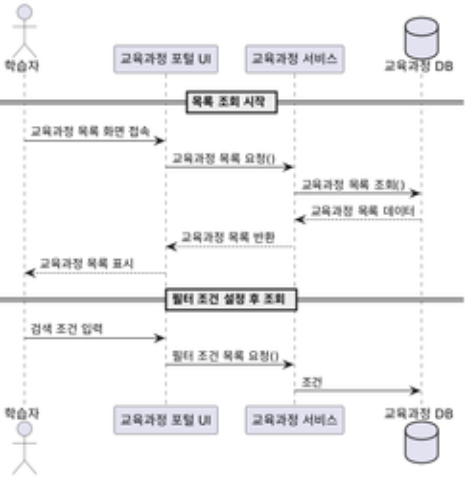
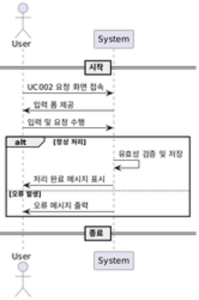
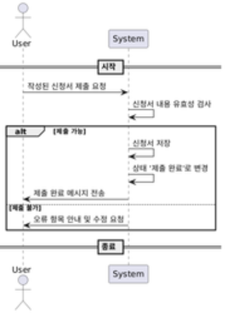
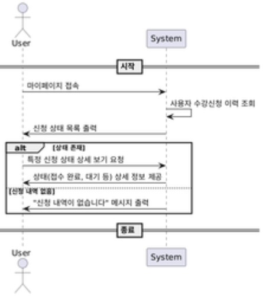
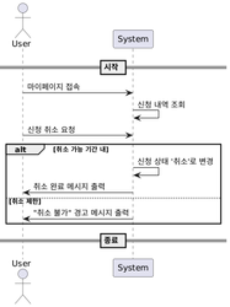
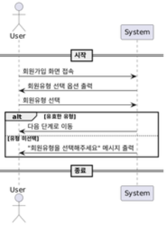

# **1. 분석 - 3. 유스케이스 명세서**
# **1. 유스케이스 목록**

|**유스케이스 ID**|**유스케이스명**|**주요 액터**|**대분류**|**중분류**|**소분류**|**관련 요구사항 ID**|
| :-: | :-: | :-: | :-: | :-: | :-: | :-: |
|UC001|교육과정 목록 조회|학습자|입학관리|접수관리|교육과정 신청|SFR-006-01|
|UC002|수강신청서 작성|학습자|입학관리|접수관리|교육과정 신청|SFR-006-02|
|UC003|수강신청서 제출|학습자|입학관리|접수관리|교육과정 신청|SFR-006-03|
|UC004|수강신청 상태 확인|학습자|입학관리|접수관리|교육과정 신청|SFR-006-04|
|UC005|수강신청 취소|학습자|입학관리|접수관리|교육과정 신청|SFR-006-05|
|UC006|회원유형 선택|사용자|회원관리|회원관리|통합회원가입|SFR-003-01|
|UC007|기본정보 입력|사용자|회원관리|회원관리|통합회원가입|SFR-003-02|
|UC008|약관 동의|사용자|회원관리|회원관리|통합회원가입|SFR-003-03|
|UC009|본인인증 수행|사용자, 인증기관|회원관리|본인인증|외부 인증기관 연계|SIR-009-01|
|UC010|회원가입 완료|시스템|회원관리|회원관리|통합회원가입|SFR-003-04|
|UC011|회원정보 수정|사용자|회원관리|회원정보수정|정보 갱신 처리|SFR-003-05|
|UC012|정보 수정 이력 저장|시스템|회원관리|회원정보수정|정보 갱신 처리|SFR-003-06|
|UC013|프로그램 정보 등록|운영자|교육운영|교육과정관리|프로그램 개설|SFR-004-01|
|UC014|프로그램 폐지 처리|운영자|교육운영|교육과정관리|프로그램 개설|SFR-004-02|
|UC015|강사 검색 및 지정|운영자|교육운영|교육과정관리|강사지정|SFR-004-03|
|UC016|강사 배정 변경/취소|운영자|교육운영|교육과정관리|강사지정|SFR-004-04|
|UC017|교육일정(차수) 설정|운영자|교육운영|교육과정관리|교육일정설정|SFR-004-05|
|UC018|혼합교육 운영 설정|운영자|교육운영|수강관리|혼합교육운영|SFR-005-01|
|UC019|콘텐츠 업로드|콘텐츠 제작자|콘텐츠관리|콘텐츠등록|콘텐츠 업로드|SFR-003-07|
|UC020|콘텐츠 수정 요청|콘텐츠 제작자|콘텐츠관리|콘텐츠등록|콘텐츠 수정|SFR-003-08|
|UC021|콘텐츠 검수 및 승인/반려|운영자|콘텐츠관리|콘텐츠등록|콘텐츠 검수|SFR-003-09|
|UC022|콘텐츠 분류 설정|운영자|콘텐츠관리|콘텐츠분류|과정유형/과목분류|SFR-003-10|
|UC023|강의실 정보 등록|운영자|시설관리|시설정보관리|강의실 현황|SFR-008-01|
|UC024|강의실 위치 정보 제공|운영자|시설관리|시설정보관리|위치정보|SFR-008-02|
|UC025|강의실 이용안내 제공|운영자|시설관리|시설정보관리|이용안내|SFR-008-03|
|UC026|대관 신청|운영자, 사용자|시설관리|대관예약관리|대관신청|SFR-008-04|
|UC027|대관 예약 승인|운영자|시설관리|대관예약관리|예약승인|SFR-008-05|
|UC028|대관 이용현황 조회|운영자|시설관리|대관예약관리|이용현황조회|SFR-008-06|
|UC029|수료증 발급|학습자, 시스템|수료관리|수료증관리|수료증 발급|SFR-007-01|
|UC030|설문 등록 및 응답 수집|운영자, 학습자|평가관리|설문관리|설문응답|SFR-009-01|
|UC031|시험 출제 및 응시|운영자, 학습자|평가관리|시험관리|시험응시|SFR-009-02|
|UC032|시험 자동 채점 및 결과 등록|시스템|평가관리|시험관리|자동채점|SFR-009-02|
|UC033|평가 통계 조회|운영자|평가관리|통계관리|평가 통계|SFR-013-04|
|UC034|마이페이지 정보 조회|학습자|포털관리|마이페이지|개인정보|SFR-007-02|
|UC035|강사 등록 신청|강사|포털관리|강사지원|강사등록|SFR-014-01|
|UC036|강의 이력 조회|강사|포털관리|강사지원|강의이력|SFR-014-02|
|UC037|강사 승인 처리|운영자|포털관리|강사지원|승인처리|SFR-014-03|
|UC038|공지사항/자료실 등록 및 조회|운영자|포털관리|커뮤니티|공지사항 및 자료실|SFR-012-01|
|UC039|희망 콘텐츠 신청|사용자|포털관리|커뮤니티|희망콘텐츠신청|SFR-012-02|
|UC040|FAQ 등록 및 열람|운영자|포털관리|커뮤니티|FAQ|SFR-012-03|
|UC041|메뉴/팝업/약관 관리|운영자|공통관리|시스템관리|메뉴관리|SFR-012-04|
|UC042|권한 설정 및 승인 요청 처리|운영자|공통관리|권한관리|권한승인요청|SFR-012-05|
|UC043|공통코드 및 그룹코드 관리|운영자|공통관리|코드관리|공통코드|SFR-012-06|
|UC044|SMS 발송 및 이력 관리|운영자|공통관리|알림관리|SMS|SFR-012-07|
|UC045|수강신청 결제 처리|학습자, 시스템|정산관리|수강신청|결제처리|SFR-011-01|
|UC046|환불 요청 및 처리|학습자, 운영자|정산관리|수강신청|환불처리|SFR-011-02|
|UC047|강사비 정산|운영자|정산관리|강사정산|강사비|SFR-011-03|
|UC048|통합회원 정보 연계|시스템|연계관리|회원연계|통합회원|SIR-009|
|UC049|교육과정 정보 연계|시스템|연계관리|교육과정연계|과정정보|SIR-010|
|UC050|교육수료 정보 연계|시스템|연계관리|교육이수연계|수료정보|SIR-011|
|UC051|수료증 신청 정보 연계|시스템|연계관리|수료증연계|수료증 신청|SIR-012|
|UC052|수료증 발급이력 연계|시스템|연계관리|수료증연계|발급이력|SIR-013|
# **2. 유스케이스 상세**
### **✅ UC001 – 교육과정 목록 조회**

|**항목**|**내용**|
| :-: | :-: |
|**유스케이스 ID**|UC001|
|**유스케이스 명**|교육과정 목록 조회|
|**관련 비즈니스 패키지**|BP001|
|**관련 요구사항**|SFR-006-01|
|**액터**|학습자|
|**사전 조건**|학습자는 시스템에 로그인되어 있어야 하며, 조회 가능한 교육과정이 존재해야 함|
|**사후 조건**|학습자는 교육과정 목록을 확인하고 수강신청 절차로 진입 가능|

-----
### **🔹 기본 흐름**
1. 학습자가 교육과정 포털에 접속한다.
1. 시스템이 개설된 교육과정 목록을 조회하여 화면에 출력한다.
1. 학습자가 검색 필터를 설정하여 조건별로 조회한다.
1. 학습자가 원하는 과정을 선택하여 상세 화면으로 진입한다.
-----
### **🔹 대안 흐름**
- **[A1] 조건 검색 결과가 없을 경우**:
  ` `시스템은 "조건에 맞는 교육과정이 없습니다" 메시지를 표시하고 필터 초기화 기능을 제공한다.
-----
### **🔹 예외 흐름 *(비즈니스 예외만 식별)***
- **[E1] 개설된 교육과정이 없는 경우**:
  ` `학습자가 목록 조회를 시도했으나 현재 등록된 교육과정이 하나도 없는 경우, 시스템은 "현재 개설된 교육과정이 없습니다" 메시지를 표시하고 목록 화면에 머무른다.
### **상호작용 다이어그램**
 
### **✅ UC002 – 수강신청서 작성**
- **유스케이스 ID**: UC002
- **유스케이스 명**: 수강신청서 작성
- **관련 비즈니스 패키지**: BP001
- **관련 요구사항**: SFR-006-02
- **액터**: 학습자
- **사전 조건**: 학습자는 로그인되어 있어야 하며, 수강신청 가능한 과정이 있어야 함
- **사후 조건**: 수강신청서 초안이 작성되어 제출 가능 상태가 됨

|**항목**|**내용**|
| :-: | :-: |
|**유스케이스 ID**|UC002|
|**유스케이스 명**|수강신청서 작성|
|**관련 비즈니스 패키지**|BP001|
|**관련 요구사항**|SFR-006-02|
|**액터**|학습자|
|**사전 조건**|학습자는 로그인되어 있어야 하며, 수강신청 가능한 과정이 있어야 함|
|**사후 조건**|수강신청서 초안이 작성되어 제출 가능 상태가 됨|

🔹 **기본 흐름**

1. 학습자가 수강신청 버튼을 클릭한다.
1. 시스템이 신청서 입력 화면을 출력한다.
1. 학습자가 이름, 연락처, 신청 과정 등의 필수 항목을 입력한다.

🔹 **대안 흐름** [A1] 필수 항목이 누락될 경우:
시스템은 누락된 항목을 표시하고, 저장을 제한한다.

🔹 **예외 흐름** [E1] 시스템 오류로 입력 폼이 로딩되지 않는 경우:
시스템은 오류 메시지를 표시하고 고객센터 안내를 제공한다.
### **상호작용 다이어그램**
 

-----
### **✅ UC003 – 수강신청서 제출**

|**항목**|**내용**|
| :-: | :-: |
|**유스케이스 ID**|UC003|
|**유스케이스 명**|수강신청서 제출|
|**관련 비즈니스 패키지**|BP001|
|**관련 요구사항**|SFR-006-03|
|**액터**|학습자|
|**사전 조건**|수강신청서가 유효하게 작성되어 있어야 함|
|**사후 조건**|신청 상태가 ‘제출 완료’로 변경됨|

🔹 **기본 흐름**

1. 학습자가 신청서 검토 후 제출 버튼을 클릭한다.
1. 시스템이 입력값을 검증하고, 제출 상태로 저장한다.
1. 신청 상태가 ‘제출 완료’로 변경된다.

🔹 **대안 흐름** [A1] 일부 항목 오류로 제출 불가할 경우:
시스템이 오류 항목을 표시하고 제출을 제한한다.

🔹 **예외 흐름** [E1] DB 오류로 저장 실패 시:
시스템은 오류 메시지를 출력하고 재시도를 유도한다.
### **상호작용 다이어그램**
 

-----
### **✅ UC004 – 수강신청 상태 확인**

|**항목**|**내용**|
| :-: | :-: |
|**유스케이스 ID**|UC004|
|**유스케이스 명**|수강신청 상태 확인|
|**관련 비즈니스 패키지**|BP001|
|**관련 요구사항**|SFR-006-04|
|**액터**|학습자|
|**사전 조건**|수강신청 이력이 있어야 함|
|**사후 조건**|학습자는 신청 상태(접수 완료/대기 등)를 확인함|

🔹 **기본 흐름**

1. 학습자가 마이페이지에 접속한다.
1. 시스템이 신청 내역을 조회하여 출력한다.
1. 학습자가 각 신청 건의 상태를 확인한다.

🔹 **대안 흐름** [A1] 상태 값이 ‘보류’인 경우:
상태에 대한 설명 팝업 또는 안내를 출력한다.

🔹 **예외 흐름** [E1] 신청 내역이 조회되지 않는 경우:
“신청 내역이 없습니다” 메시지를 출력
### **상호작용 다이어그램**
 

-----
### **✅ UC005 – 수강신청 취소**

|**항목**|**내용**|
| :-: | :-: |
|**유스케이스 ID**|UC005|
|**유스케이스 명**|수강신청서 취소|
|**관련 비즈니스 패키지**|BP001|
|**관련 요구사항**|SFR-006-05|
|**액터**|학습자|
|**사전 조건**|제출 완료된 수강신청이 존재해야 하며, 취소 가능 기간 내여야 함|
|**사후 조건**|신청 상태가 ‘취소’로 변경됨|

🔹 **기본 흐름**

1. 학습자가 마이페이지에서 신청 내역을 조회한다.
1. 신청 건을 선택하고 ‘취소’ 버튼을 클릭한다.
1. 시스템이 취소 요청을 처리하고 상태를 ‘취소’로 변경한다.

🔹 **대안 흐름** [A1] 이미 개강된 과정일 경우:
시스템은 “개강 이후에는 취소가 불가능합니다” 메시지를 출력

🔹 **예외 흐름** [E1] 취소 기한이 지난 경우:
시스템은 취소 제한 안내를 하고 취소 요청을 차단함
### **상호작용 다이어그램**
 

-----
### **✅ UC006 – 회원유형 선택**

|**항목**|**내용**|
| :-: | :-: |
|**유스케이스 ID**|UC006|
|**유스케이스 명**|회원유형 선택|
|**관련 비즈니스 패키지**|BP002|
|**관련 요구사항**|SFR-003-01SFR-003-01|
|**액터**|사용자|
|**사전 조건**|사용자는 회원가입 화면에 접속한 상태여야 함|
|**사후 조건**|선택한 유형에 따라 가입 흐름이 분기됨|

🔹 **기본 흐름**

1. 사용자가 회원가입 화면에 접속한다.
1. 시스템이 선택 가능한 회원유형(학습자, 강사, 관리자 등)을 출력한다.
1. 사용자가 해당 유형을 선택한다.

🔹 **대안 흐름** [A1] 유형 선택 없이 다음 단계 진행 시:
시스템이 경고 메시지를 출력하고 진행을 제한한다.

🔹 **예외 흐름** [E1] 유형 코드가 시스템에 등록되어 있지 않은 경우:
시스템은 오류 메시지를 출력하고 관리자로 문의하도록 안내한다.
### **상호작용 다이어그램**
 

-----
### **✅ UC007 – 기본정보 입력**

|**항목**|**내용**|
| :-: | :-: |
|**유스케이스 ID**|UC007|
|**유스케이스 명**|기본정보 입력|
|**관련 비즈니스 패키지**|BP002|
|**관련 요구사항**|SFR-003-02|
|**액터**|사용자|
|**사전 조건**|회원유형이 선택되어야 함|
|**사후 조건**|사용자 기본정보가 임시 저장되며 다음 절차로 이동 가능|

🔹 **기본 흐름**

1. 시스템이 기본정보 입력 양식을 제공한다.
1. 사용자가 이름, 생년월일, 연락처, 이메일 등을 입력한다.
1. 시스템이 입력값의 유효성을 검증한다.

🔹 **대안 흐름** [A1] 이메일 형식 오류 등 입력값이 잘못된 경우:
시스템은 오류 메시지와 함께 수정 유도를 제공한다.

🔹 **예외 흐름** [E1] 중복된 연락처나 이메일 입력 시:
시스템은 중복 경고 메시지를 출력하고 다른 값을 요구한다.

-----
### **✅ UC008 – 약관 동의**

|**항목**|**내용**|
| :-: | :-: |
|**유스케이스 ID**|UC008|
|**유스케이스 명**|약관 동의|
|**관련 비즈니스 패키지**|BP002|
|**관련 요구사항**|SFR-003-03|
|**액터**|사용자|
|**사전 조건**|기본정보 입력이 완료되어야 함|
|**사후 조건**|필수 약관 동의 시 다음 단계로 진행 가능|

🔹 **기본 흐름**

1. 시스템이 약관 목록(필수, 선택)을 출력한다.
1. 사용자가 각 약관에 체크하고 동의한다.
1. 필수 약관 동의 여부를 확인한 후 다음 단계로 이동한다.

🔹 **대안 흐름** [A1] 선택 약관만 동의한 경우:
시스템은 필수 약관 체크를 유도한다.

🔹 **예외 흐름** [E1] 사용자가 모두 비동의할 경우:
가입 진행이 불가능하다는 안내를 하고 약관 화면에 머무름

-----
### **✅ UC009 – 본인인증 수행**

|**항목**|**내용**|
| :-: | :-: |
|**유스케이스 ID**|UC009|
|**유스케이스 명**|본인인증 수행|
|**관련 비즈니스 패키지**|BP001|
|**관련 요구사항**|SFR-009-01|
|**액터**|사용자, 인증기관|
|**사전 조건**|약관 동의가 완료되어야 함|
|**사후 조건**|인증 성공 시 다음 가입 단계로 진행|

🔹 **기본 흐름**

1. 사용자가 본인인증 방식을 선택한다 (PASS, 공동인증서 등).
1. 시스템이 인증기관과 연동하여 실명/휴대폰 인증을 수행한다.
1. 인증 성공 시 시스템은 인증 결과를 저장하고 다음 단계로 전환한다.

🔹 **대안 흐름** [A1] 인증 방식 선택 후 사용자 입력값 오류:
시스템이 잘못된 입력임을 안내하고 수정 요청

🔹 **예외 흐름** [E1] 인증 실패 (번호 불일치, 시간 초과 등):
인증 실패 사유를 출력하고 재인증을 유도

-----
### **✅ UC010 – 회원가입 완료**

|**항목**|**내용**|
| :-: | :-: |
|**유스케이스 ID**|UC010|
|**유스케이스 명**|회원가입 완료|
|**관련 비즈니스 패키지**|BP002|
|**관련 요구사항**|SFR-003-04|
|**액터**|시스템|
|**사전 조건**|본인인증까지 성공적으로 완료되어야 함|
|**사후 조건**|계정이 생성되고 로그인 안내가 제공됨|

🔹 **기본 흐름**

1. 시스템이 가입 정보를 검증한 후 사용자 계정을 생성한다.
1. 가입 완료 메시지와 함께 로그인 페이지로 전환된다.
1. 사용자 이메일로 가입 완료 안내 메시지를 발송한다.

🔹 **대안 흐름** [A1] 사용자 입력정보 중 유효성 미충족 시:
시스템은 오류 메시지를 출력하고 수정 요청

🔹 **예외 흐름** [E1] 서버 오류로 계정 생성 실패 시:
시스템은 오류 메시지를 출력하고, 고객센터 안내 제공

-----
### **✅ UC011 – 회원정보 수정**
- **유스케이스 ID**: UC011
- **유스케이스 명**: 회원정보 수정
- **관련 비즈니스 패키지**: BP004
- **관련 요구사항**: SFR-003-05
- **액터**: 사용자
- **사전 조건**: 로그인 상태이며 수정 가능한 정보가 존재해야 함
- **사후 조건**: 사용자 정보가 수정되어 저장됨

|**항목**|**내용**|
| :-: | :-: |
|**유스케이스 ID**|UC011|
|**유스케이스 명**|회원정보 수정|
|**관련 비즈니스 패키지**|BP004|
|**관련 요구사항**|SFR-003-05|
|**액터**|사용자|
|**사전 조건**|로그인 상태이며 수정 가능한 정보가 존재해야 함|
|**사후 조건**|사용자 정보가 수정되어 저장됨|

🔹 **기본 흐름**

1. 사용자가 마이페이지 또는 정보 수정 화면에 접속한다.
1. 시스템이 현재 등록된 정보를 불러와 출력한다.
1. 사용자가 수정할 정보를 입력하고 저장한다.

🔹 **대안 흐름** [A1] 비밀번호 또는 인증 절차 요구 항목이 포함된 경우:
시스템은 본인인증 절차를 유도한다.

🔹 **예외 흐름** [E1] 필수 정보 누락 또는 유효성 오류 시:
시스템은 오류 메시지를 출력하고 저장을 제한한다.

-----
### **✅ UC012 – 정보 수정 이력 저장**
- **유스케이스 ID**: UC012
- **유스케이스 명**: 정보 수정 이력 저장
- **관련 비즈니스 패키지**: BP004
- **관련 요구사항**: SFR-003-06
- **액터**: 시스템
- **사전 조건**: 정보 수정이 정상적으로 완료되어야 함
- **사후 조건**: 변경 전후 이력이 시스템에 저장됨

|**항목**|**내용**|
| :-: | :-: |
|**유스케이스 ID**|UC012|
|**유스케이스 명**|정보 수정 이력 저장|
|**관련 비즈니스 패키지**|BP004|
|**관련 요구사항**|SFR-003-06|
|**액터**|시스템|
|**사전 조건**|정보 수정이 정상적으로 완료되어야 함|
|**사후 조건**|변경 전후 이력이 시스템에 저장됨|

🔹 **기본 흐름**

1. 시스템이 사용자의 정보 수정 요청을 수신한다.
1. 변경된 필드에 대해 이전 값과 변경 값을 저장한다.
1. 수정 이력은 감사로그로 기록되며 열람 가능 상태가 된다.

🔹 **대안 흐름** [A1] 이력 저장 실패 시:
시스템은 관리자에게 알림을 전송하고 재시도 로직을 수행한다.

🔹 **예외 흐름** [E1] 로그 저장소 접근 오류 발생 시:
이력 저장은 실패하고 오류 메시지가 관리자에게 전달됨

-----
### **✅ UC013 – 프로그램 정보 등록**
- **유스케이스 ID**: UC013
- **유스케이스 명**: 프로그램 정보 등록
- **관련 비즈니스 패키지**: BP005
- **관련 요구사항**: SFR-004-01
- **액터**: 운영자
- **사전 조건**: 운영자는 시스템에 로그인되어 있어야 하며, 프로그램 등록 권한이 있어야 함
- **사후 조건**: 신규 교육 프로그램이 등록됨

|**항목**|**내용**|
| :-: | :-: |
|**유스케이스 ID**|UC013|
|**유스케이스 명**|프로그램 정보 등록|
|**관련 비즈니스 패키지**|BP005|
|**관련 요구사항**|SFR-004-01|
|**액터**|운영자|
|**사전 조건**|운영자는 시스템에 로그인되어 있어야 하며, 프로그램 등록 권한이 있어야 함|
|**사후 조건**|신규 교육 프로그램이 등록됨|

🔹 **기본 흐름**

1. 운영자가 프로그램 등록 화면에 진입한다.
1. 프로그램명, 대상, 유형, 차수, 장소, 요금 등 정보를 입력한다.
1. 시스템이 입력값을 저장하고 등록 완료 상태로 전환한다.

🔹 **대안 흐름** [A1] 오프라인 프로그램의 경우:
운영자는 강의실 정보와 수용 인원 등을 추가 입력해야 한다.

🔹 **예외 흐름** [E1] 필수 입력 누락 또는 중복된 프로그램명 입력 시:
시스템은 오류 메시지를 표시하고 저장을 차단한다.

-----
### **✅ UC014 – 프로그램 폐지 처리**
- **유스케이스 ID**: UC014
- **유스케이스 명**: 프로그램 폐지 처리
- **관련 비즈니스 패키지**: BP005
- **관련 요구사항**: SFR-004-02
- **액터**: 운영자
- **사전 조건**: 폐지할 프로그램이 운영 중 상태여야 함
- **사후 조건**: 프로그램이 종료 또는 폐지 상태로 전환됨

|**항목**|**내용**|
| :-: | :-: |
|**유스케이스 ID**|UC014|
|**유스케이스 명**|프로그램 폐지 처리|
|**관련 비즈니스 패키지**|BP005|
|**관련 요구사항**|SFR-004-02|
|**액터**|운영자|
|**사전 조건**|폐지할 프로그램이 운영 중 상태여야 함|
|**사후 조건**|프로그램이 종료 또는 폐지 상태로 전환됨|

🔹 **기본 흐름**

1. 운영자가 프로그램 목록에서 종료할 대상을 선택한다.
1. 폐지 사유를 입력하고 폐지 요청을 저장한다.
1. 시스템이 프로그램 상태를 ‘폐지’로 변경하고 사용자 조회를 차단한다.

🔹 **대안 흐름** [A1] 수강 신청자가 존재하는 경우:
시스템은 경고 메시지를 출력하고 강제 종료 여부를 확인받는다.

🔹 **예외 흐름** [E1] 프로그램이 이미 종료 상태일 경우:
시스템은 “이미 종료된 프로그램입니다” 메시지를 표시하고 처리하지 않음

-----
### **✅ UC015 – 강사 검색 및 지정**
- **유스케이스 ID**: UC015
- **유스케이스 명**: 강사 검색 및 지정
- **관련 비즈니스 패키지**: BP006
- **관련 요구사항**: SFR-004-03
- **액터**: 운영자
- **사전 조건**: 등록된 강사 목록(강사풀)이 존재해야 함
- **사후 조건**: 해당 교육 과정에 강사가 지정됨

|**항목**|**내용**|
| :-: | :-: |
|**유스케이스 ID**|UC015|
|**유스케이스 명**|강사 검색 및 지정|
|**관련 비즈니스 패키지**|BP006|
|**관련 요구사항**|SFR-004-03|
|**액터**|운영자|
|**사전 조건**|등록된 강사 목록(강사풀)이 존재해야 함|
|**사후 조건**|해당 교육 과정에 강사가 지정됨|

🔹 **기본 흐름**

1. 운영자가 강사 지정 화면에 접속한다.
1. 강사풀에서 자격, 분야, 가능 일정 조건을 설정하여 검색한다.
1. 검색 결과에서 적합한 강사를 선택하여 지정한다.

🔹 **대안 흐름** [A1] 조건 검색 결과가 없는 경우:
시스템은 “조건에 맞는 강사가 없습니다” 메시지를 출력하고 필터 초기화를 유도한다.

🔹 **예외 흐름** [E1] 선택한 강사가 이미 동일 기간에 배정된 경우:
시스템은 중복 배정 경고를 출력하고 다른 강사 선택을 유도한다.

-----
### **✅ UC016 – 강사 배정 변경/취소**
- **유스케이스 ID**: UC016
- **유스케이스 명**: 강사 배정 변경/취소
- **관련 비즈니스 패키지**: BP006
- **관련 요구사항**: SFR-004-04
- **액터**: 운영자
- **사전 조건**: 강사가 기존에 배정되어 있어야 함
- **사후 조건**: 강사 배정이 변경되거나 해제됨

|**항목**|**내용**|
| :-: | :-: |
|**유스케이스 ID**|UC016|
|**유스케이스 명**|강사 배정 변경/취소|
|**관련 비즈니스 패키지**|BP006|
|**관련 요구사항**|SFR-004-04|
|**액터**|운영자|
|**사전 조건**|강사가 기존에 배정되어 있어야 함|
|**사후 조건**|강사 배정이 변경되거나 해제됨|

🔹 **기본 흐름**

1. 운영자가 강사 배정 목록을 조회한다.
1. 변경 또는 해제할 강사를 선택한다.
1. 새로운 강사를 재배정하거나, 기존 배정을 취소 처리한다.

🔹 **대안 흐름** [A1] 변경 사유를 시스템에 입력하도록 유도함

🔹 **예외 흐름** [E1] 강의 시작일이 임박해 변경 불가한 경우:
시스템은 경고 메시지를 출력하고 변경을 차단함

-----
### **✅ UC017 – 교육일정(차수) 설정**
- **유스케이스 ID**: UC017
- **유스케이스 명**: 교육일정(차수) 설정
- **관련 비즈니스 패키지**: BP007
- **관련 요구사항**: SFR-004-05
- **액터**: 운영자
- **사전 조건**: 프로그램이 등록되어 있어야 함
- **사후 조건**: 차수별 일정 및 시간표가 구성됨

|**항목**|**내용**|
| :-: | :-: |
|**유스케이스 ID**|UC017|
|**유스케이스 명**|교육일정(차수) 설정|
|**관련 비즈니스 패키지**|BP007|
|**관련 요구사항**|SFR-004-05|
|**액터**|운영자|
|**사전 조건**|프로그램이 등록되어 있어야 함|
|**사후 조건**|차수별 일정 및 시간표가 구성됨|

🔹 **기본 흐름**

1. 운영자가 해당 프로그램의 차수를 생성한다.
1. 교육 시작일, 종료일, 요일, 시간 등 일정을 등록한다.
1. 오프라인의 경우 강의장소도 함께 매핑하여 시간표를 구성한다.

🔹 **대안 흐름** [A1] 동일 시간대에 중복되는 강의장 또는 강사 있는 경우 경고 출력

🔹 **예외 흐름** [E1] 잘못된 날짜 범위(종료일이 시작일보다 빠름) 입력 시 오류 메시지 출력

-----
### **✅ UC018 – 혼합교육 운영 설정**
- **유스케이스 ID**: UC018
- **유스케이스 명**: 혼합교육 운영 설정
- **관련 비즈니스 패키지**: BP007
- **관련 요구사항**: SFR-005-01
- **액터**: 운영자
- **사전 조건**: 교육 과정이 혼합 운영 대상임
- **사후 조건**: 오프라인 및 온라인 수업 일정을 통합한 시간표 생성

|**항목**|**내용**|
| :-: | :-: |
|**유스케이스 ID**|UC018|
|**유스케이스 명**|혼합교육 운영 설정|
|**관련 비즈니스 패키지**|BP007|
|**관련 요구사항**|SFR-005-01|
|**액터**|운영자|
|**사전 조건**|교육 과정이 혼합 운영 대상임|
|**사후 조건**|오프라인 및 온라인 수업 일정을 통합한 시간표 생성|

🔹 **기본 흐름**

1. 운영자가 혼합교육 과정을 선택하고 설정 화면으로 진입한다.
1. 온라인 수업 콘텐츠와 오프라인 일정이 병행되도록 설정한다.
1. 출결, 진도율, 수료기준을 등록하고 저장한다.

🔹 **대안 흐름** [A1] 오프라인 일정 없이 콘텐츠만 있는 경우 경고 출력 및 단일형 교육으로 변경 유도

🔹 **예외 흐름** [E1] 온라인 콘텐츠가 아직 등록되지 않은 경우 저장 차단 및 안내

-----
### **✅ UC019 – 콘텐츠 업로드**
- **유스케이스 ID**: UC019
- **유스케이스 명**: 콘텐츠 업로드
- **관련 비즈니스 패키지**: BP020
- **관련 요구사항**: SFR-003-07
- **액터**: 콘텐츠 제작자
- **사전 조건**: 로그인 상태이며 업로드 권한이 있어야 함
- **사후 조건**: 콘텐츠 파일이 시스템에 저장됨

|**항목**|**내용**|
| :-: | :-: |
|**유스케이스 ID**|UC002|
|**유스케이스 명**|수강신청서 작성|
|**관련 비즈니스 패키지**|BP001|
|**관련 요구사항**|SFR-006-02|
|**액터**|학습자|
|**사전 조건**|학습자는 로그인되어 있어야 하며, 수강신청 가능한 과정이 있어야 함|
|**사후 조건**|수강신청서 초안이 작성되어 제출 가능 상태가 됨|

🔹 **기본 흐름**

1. 콘텐츠 제작자가 콘텐츠 등록 화면에 접속한다.
1. 콘텐츠 파일(mp4, pdf 등)을 업로드한다.
1. 제목, 설명, 버전 등 메타 정보를 입력하고 저장한다.

🔹 **대안 흐름** [A1] 동일 콘텐츠명 존재 시 중복 경고 출력

🔹 **예외 흐름** [E1] 파일 형식 또는 용량 초과 시 업로드 차단

-----
### **✅ UC020 – 콘텐츠 수정 요청**
- **유스케이스 ID**: UC020
- **유스케이스 명**: 콘텐츠 수정 요청
- **관련 비즈니스 패키지**: BP022
- **관련 요구사항**: SFR-003-08
- **액터**: 콘텐츠 제작자
- **사전 조건**: 기존에 등록된 콘텐츠가 있어야 함
- **사후 조건**: 수정된 콘텐츠가 재검수 대상으로 등록됨

|**항목**|**내용**|
| :-: | :-: |
|**유스케이스 ID**|UC002|
|**유스케이스 명**|수강신청서 작성|
|**관련 비즈니스 패키지**|BP001|
|**관련 요구사항**|SFR-006-02|
|**액터**|학습자|
|**사전 조건**|학습자는 로그인되어 있어야 하며, 수강신청 가능한 과정이 있어야 함|
|**사후 조건**|수강신청서 초안이 작성되어 제출 가능 상태가 됨|

🔹 **기본 흐름**

1. 콘텐츠 제작자가 수정할 콘텐츠를 검색한다.
1. 콘텐츠 내용을 일부 수정하거나 파일을 교체한다.
1. 수정 요청을 등록하고 재검수를 요청한다.

🔹 **대안 흐름** [A1] 수정 이유 입력란에 상세 사유 기입 유도

🔹 **예외 흐름** [E1] 승인된 콘텐츠를 임의로 수정 시도 시:
시스템은 “승인 콘텐츠는 직접 수정 불가” 경고를 출력함

-----
### **✅ UC021 – 콘텐츠 검수 및 승인/반려**
- **유스케이스 ID**: UC021
- **유스케이스 명**: 콘텐츠 검수 및 승인/반려
- **관련 비즈니스 패키지**: BP023
- **관련 요구사항**: SFR-003-09
- **액터**: 운영자
- **사전 조건**: 콘텐츠가 승인 대기 상태로 등록되어 있어야 함
- **사후 조건**: 콘텐츠가 승인되거나 반려됨

|**항목**|**내용**|
| :-: | :-: |
|**유스케이스 ID**|UC002|
|**유스케이스 명**|수강신청서 작성|
|**관련 비즈니스 패키지**|BP001|
|**관련 요구사항**|SFR-006-02|
|**액터**|학습자|
|**사전 조건**|학습자는 로그인되어 있어야 하며, 수강신청 가능한 과정이 있어야 함|
|**사후 조건**|수강신청서 초안이 작성되어 제출 가능 상태가 됨|

🔹 **기본 흐름**

1. 운영자가 검수 화면에 접속하여 승인 대기 콘텐츠 목록을 조회한다.
1. 콘텐츠 내용을 검토한다 (구성, 품질, 저작권 등).
1. 검토 결과에 따라 콘텐츠를 승인하거나 반려 처리한다.

🔹 **대안 흐름** [A1] 반려 시 사유 입력을 필수로 설정하여 피드백 제공

🔹 **예외 흐름** [E1] 콘텐츠가 손상되어 열리지 않는 경우:
시스템은 오류 메시지를 출력하고 검수를 중단함

-----
### **✅ UC022 – 콘텐츠 분류 설정**
- **유스케이스 ID**: UC022
- **유스케이스 명**: 콘텐츠 분류 설정
- **관련 비즈니스 패키지**: BP024
- **관련 요구사항**: SFR-003-10
- **액터**: 운영자
- **사전 조건**: 콘텐츠가 등록되어 있어야 함
- **사후 조건**: 콘텐츠가 유형, 분야, 대상자 등에 따라 분류됨

|**항목**|**내용**|
| :-: | :-: |
|**유스케이스 ID**|UC002|
|**유스케이스 명**|수강신청서 작성|
|**관련 비즈니스 패키지**|BP001|
|**관련 요구사항**|SFR-006-02|
|**액터**|학습자|
|**사전 조건**|학습자는 로그인되어 있어야 하며, 수강신청 가능한 과정이 있어야 함|
|**사후 조건**|수강신청서 초안이 작성되어 제출 가능 상태가 됨|

🔹 **기본 흐름**

1. 운영자가 콘텐츠 분류 화면에 접속한다.
1. 콘텐츠 유형(기초/심화), 분야(지도자/심판), 대상 등을 선택한다.
1. 설정된 기준에 따라 콘텐츠를 분류하여 저장한다.

🔹 **대안 흐름** [A1] 기존 분류를 기반으로 자동 추천 분류값 제공

🔹 **예외 흐름** [E1] 분류 기준 누락 시 저장 차단

-----
### **✅ UC023 – 강의실 정보 등록**
- **유스케이스 ID**: UC023
- **유스케이스 명**: 강의실 정보 등록
- **관련 비즈니스 패키지**: BP025
- **관련 요구사항**: SFR-008-01
- **액터**: 운영자
- **사전 조건**: 강의실 등록 권한이 있어야 함
- **사후 조건**: 신규 강의실 정보가 시스템에 등록됨

|**항목**|**내용**|
| :-: | :-: |
|**유스케이스 ID**|UC002|
|**유스케이스 명**|수강신청서 작성|
|**관련 비즈니스 패키지**|BP001|
|**관련 요구사항**|SFR-006-02|
|**액터**|학습자|
|**사전 조건**|학습자는 로그인되어 있어야 하며, 수강신청 가능한 과정이 있어야 함|
|**사후 조건**|수강신청서 초안이 작성되어 제출 가능 상태가 됨|

🔹 **기본 흐름**

1. 운영자가 강의실 등록 화면에 접속한다.
1. 강의실명, 위치, 수용 인원, 용도 등을 입력한다.
1. 등록 내용을 저장하여 강의실 정보를 시스템에 반영한다.

🔹 **대안 흐름** [A1] 동일 위치에 동일 강의실명 존재 시 중복 경고 출력

🔹 **예외 흐름** [E1] 수용 인원이 숫자 형식이 아닐 경우 저장 실패

-----
### **✅ UC024 – 강의실 위치 정보 제공**
- **유스케이스 ID**: UC024
- **유스케이스 명**: 강의실 위치 정보 제공
- **관련 비즈니스 패키지**: BP026
- **관련 요구사항**: SFR-008-02
- **액터**: 운영자
- **사전 조건**: 강의실 정보가 등록되어 있어야 함
- **사후 조건**: 강의실 위치가 지도 기반으로 출력됨

|**항목**|**내용**|
| :-: | :-: |
|**유스케이스 ID**|UC002|
|**유스케이스 명**|수강신청서 작성|
|**관련 비즈니스 패키지**|BP001|
|**관련 요구사항**|SFR-006-02|
|**액터**|학습자|
|**사전 조건**|학습자는 로그인되어 있어야 하며, 수강신청 가능한 과정이 있어야 함|
|**사후 조건**|수강신청서 초안이 작성되어 제출 가능 상태가 됨|

🔹 **기본 흐름**

1. 운영자가 강의실 위치 정보를 입력한다 (주소, 건물명, 층수 등).
1. 시스템이 지도 API를 연동하여 시각화된 위치를 제공한다.
1. 사용자 화면에서도 위치 정보와 함께 접근성 정보가 제공된다.

🔹 **대안 흐름** [A1] 접근성 정보(엘리베이터, 주차장 등) 선택 항목도 함께 입력

🔹 **예외 흐름** [E1] 지도 API 오류로 위치 시각화 불가 시:
시스템은 텍스트 기반 위치만 제공함

-----
### **✅ UC025 – 강의실 이용안내 제공**
- **유스케이스 ID**: UC025
- **유스케이스 명**: 강의실 이용안내 제공
- **관련 비즈니스 패키지**: BP027
- **관련 요구사항**: SFR-008-03
- **액터**: 운영자
- **사전 조건**: 강의실 정보가 등록되어 있어야 함
- **사후 조건**: 이용 가능 시간 및 유의사항이 사용자에게 안내됨

|**항목**|**내용**|
| :-: | :-: |
|**유스케이스 ID**|UC002|
|**유스케이스 명**|수강신청서 작성|
|**관련 비즈니스 패키지**|BP001|
|**관련 요구사항**|SFR-006-02|
|**액터**|학습자|
|**사전 조건**|학습자는 로그인되어 있어야 하며, 수강신청 가능한 과정이 있어야 함|
|**사후 조건**|수강신청서 초안이 작성되어 제출 가능 상태가 됨|

🔹 **기본 흐름**

1. 운영자가 이용안내 화면에 접속한다.
1. 강의실 이용 가능 요일 및 시간대를 등록한다.
1. 주의사항, 예약 유의사항 등을 입력하여 저장한다.

🔹 **대안 흐름** [A1] 템플릿 기반으로 이용안내 문구를 불러올 수 있음

🔹 **예외 흐름** [E1] 이용 시간과 강의 배정 시간 충돌 시:
시스템은 경고 메시지를 출력하고 수정 유도

-----
### **✅ UC026 – 대관 신청**
- **유스케이스 ID**: UC026
- **유스케이스 명**: 대관 신청
- **관련 비즈니스 패키지**: BP028
- **관련 요구사항**: SFR-008-04
- **액터**: 운영자, 사용자
- **사전 조건**: 대관 신청 가능한 강의실이 등록되어 있어야 함
- **사후 조건**: 대관 신청서가 저장되고 승인 대기 상태가 됨

|**항목**|**내용**|
| :-: | :-: |
|**유스케이스 ID**|UC002|
|**유스케이스 명**|수강신청서 작성|
|**관련 비즈니스 패키지**|BP001|
|**관련 요구사항**|SFR-006-02|
|**액터**|학습자|
|**사전 조건**|학습자는 로그인되어 있어야 하며, 수강신청 가능한 과정이 있어야 함|
|**사후 조건**|수강신청서 초안이 작성되어 제출 가능 상태가 됨|

🔹 **기본 흐름**

1. 사용자가 대관 신청 화면에 접속한다.
1. 사용 가능한 강의실과 일정 정보를 조회한다.
1. 희망 일정 선택 후 신청 정보를 입력하고 제출한다.

🔹 **대안 흐름** [A1] 신청자 유형(내부/외부)에 따라 입력 항목 차별화

🔹 **예외 흐름** [E1] 선택한 시간대가 이미 예약된 경우:
시스템은 중복 알림을 표시하고 재선택을 유도함

-----
### **✅ UC027 – 대관 예약 승인**
- **유스케이스 ID**: UC027
- **유스케이스 명**: 대관 예약 승인
- **관련 비즈니스 패키지**: BP029
- **관련 요구사항**: SFR-008-05
- **액터**: 운영자
- **사전 조건**: 대관 신청이 제출되어 있어야 함
- **사후 조건**: 승인 또는 반려 결과가 신청자에게 전달됨

|**항목**|**내용**|
| :-: | :-: |
|**유스케이스 ID**|UC002|
|**유스케이스 명**|수강신청서 작성|
|**관련 비즈니스 패키지**|BP001|
|**관련 요구사항**|SFR-006-02|
|**액터**|학습자|
|**사전 조건**|학습자는 로그인되어 있어야 하며, 수강신청 가능한 과정이 있어야 함|
|**사후 조건**|수강신청서 초안이 작성되어 제출 가능 상태가 됨|

🔹 **기본 흐름**

1. 운영자가 대관 신청 내역을 조회한다.
1. 신청 목적 및 강의실 이용 가능 여부를 확인한다.
1. 승인 또는 반려를 결정하고 시스템에 처리한다.

🔹 **대안 흐름** [A1] 예약이 겹치는 경우, 시간 조정 또는 대체 장소 안내 기능 활용

🔹 **예외 흐름** [E1] 승인 처리 중 시스템 오류 발생 시:
승인 보류 상태로 변경하고 관리자에게 알림 전송

-----
### **✅ UC028 – 대관 이용현황 조회**
- **유스케이스 ID**: UC028
- **유스케이스 명**: 대관 이용현황 조회
- **관련 비즈니스 패키지**: BP030
- **관련 요구사항**: SFR-008-06
- **액터**: 운영자, 사용자
- **사전 조건**: 대관 신청 및 승인된 내역이 존재해야 함
- **사후 조건**: 이용현황이 달력 또는 목록 형식으로 출력됨

|**항목**|**내용**|
| :-: | :-: |
|**유스케이스 ID**|UC002|
|**유스케이스 명**|수강신청서 작성|
|**관련 비즈니스 패키지**|BP001|
|**관련 요구사항**|SFR-006-02|
|**액터**|학습자|
|**사전 조건**|학습자는 로그인되어 있어야 하며, 수강신청 가능한 과정이 있어야 함|
|**사후 조건**|수강신청서 초안이 작성되어 제출 가능 상태가 됨|

🔹 **기본 흐름**

1. 운영자 또는 사용자가 이용현황 화면에 접속한다.
1. 날짜/시간/강의실 기준으로 필터를 설정한다.
1. 시스템이 현황 정보를 시각적으로 출력한다 (캘린더 형식 포함).

🔹 **대안 흐름** [A1] 검색 조건 저장 기능을 통해 반복 조회 편의성 제공

🔹 **예외 흐름** [E1] 해당 기간에 신청된 내용이 없을 경우:
“조회된 내용이 없습니다” 메시지 출력

-----
### **✅ UC029 – 수료증 발급**
- **유스케이스 ID**: UC029
- **유스케이스 명**: 수료증 발급
- **관련 비즈니스 패키지**: BP016
- **관련 요구사항**: SFR-007-01
- **액터**: 학습자, 시스템
- **사전 조건**: 수료 조건(출석률, 진도율, 시험 결과 등)을 충족해야 함
- **사후 조건**: 수료증이 PDF 형태로 자동 생성되어 제공됨

|**항목**|**내용**|
| :-: | :-: |
|**유스케이스 ID**|UC002|
|**유스케이스 명**|수강신청서 작성|
|**관련 비즈니스 패키지**|BP001|
|**관련 요구사항**|SFR-006-02|
|**액터**|학습자|
|**사전 조건**|학습자는 로그인되어 있어야 하며, 수강신청 가능한 과정이 있어야 함|
|**사후 조건**|수강신청서 초안이 작성되어 제출 가능 상태가 됨|

🔹 **기본 흐름**

1. 시스템이 이수 조건을 충족한 학습자를 식별한다.
1. 수료증 내용을 기반으로 전자 문서를 자동 생성한다.
1. 학습자는 마이페이지에서 수료증을 조회하거나 다운로드한다.

🔹 **대안 흐름** [A1] 사용자가 수기 수료증 발급을 신청할 수 있는 별도 프로세스 운영

🔹 **예외 흐름** [E1] 수료 조건 충족 여부 판단 로직 오류 시:
시스템은 오류 로그를 기록하고 관리자에게 알림 전송

-----
### **✅ UC030 – 설문 등록 및 응답 수집**
- **유스케이스 ID**: UC030
- **유스케이스 명**: 설문 등록 및 응답 수집
- **관련 비즈니스 패키지**: BP017
- **관련 요구사항**: SFR-009-01
- **액터**: 운영자, 학습자
- **사전 조건**: 교육 과정이 종료되었거나 설문 시점이 도래해야 함
- **사후 조건**: 설문 응답이 수집되어 통계로 활용 가능

|**항목**|**내용**|
| :-: | :-: |
|**유스케이스 ID**|UC002|
|**유스케이스 명**|수강신청서 작성|
|**관련 비즈니스 패키지**|BP001|
|**관련 요구사항**|SFR-006-02|
|**액터**|학습자|
|**사전 조건**|학습자는 로그인되어 있어야 하며, 수강신청 가능한 과정이 있어야 함|
|**사후 조건**|수강신청서 초안이 작성되어 제출 가능 상태가 됨|

🔹 **기본 흐름**

1. 운영자가 설문 항목을 등록한다 (사전/사후, 주관식/객관식 등).
1. 학습자가 설문에 응답한다 (웹/모바일).
1. 시스템은 응답 결과를 저장하고 통계 분석을 위한 데이터로 전환한다.

🔹 **대안 흐름** [A1] 미응답자에 대해 자동 리마인드 메시지 발송

🔹 **예외 흐름** [E1] 설문 기간이 만료된 경우:
시스템은 응답을 차단하고 안내 메시지를 출력

-----
✅ UC031 – 시험 출제 및 응시

|**항목**|**내용**|
| :-: | :-: |
|**유스케이스 ID**|UC031|
|**유스케이스 명**|시험 출제 및 응시|
|**주요 액터**|운영자, 학습자|
|**연관 시스템**|평가관리 시스템|
|**대분류**|평가관리|
|**중분류**|시험관리|
|**관련 요구사항**|SFR-009-02|
|**사전 조건**|시험이 등록되어 있어야 하며 학습자는 해당 시험을 응시할 권한이 있어야 함|
|**사후 조건**|시험이 정상적으로 제출되고 시점별로 결과가 저장됨|
### **🎯 기본 흐름**
1. 운영자가 시험 문제를 출제하여 시험관리 시스템에 등록한다.
1. 학습자는 시험 목록에서 본인이 응시할 시험을 선택하여 응시한다.
1. 시험을 제출하면 응답 결과가 시스템에 저장된다.
### **💡 대안 흐름**
- **[A1]** 시험 제출 후 자동 저장 실패 시, 시스템은 사용자에게 저장 실패 메시지를 알리고 재시도를 유도한다.
### **⚠ 예외 흐름**
- **[E1]** 시험 시간이 초과되면 시스템이 시험을 자동으로 제출 처리한다.
-----
## **✅ UC032 – 시험 자동 채점 및 결과 등록**

|**항목**|**내용**|
| :-: | :-: |
|**유스케이스 ID**|UC032|
|**유스케이스 명**|시험 자동 채점 및 결과 등록|
|**주요 액터**|시스템|
|**연관 시스템**|평가관리 시스템|
|**대분류**|평가관리|
|**중분류**|시험관리|
|**관련 요구사항**|SFR-009-02|
|**사전 조건**|학습자가 시험을 정상적으로 제출한 상태여야 함|
|**사후 조건**|채점 결과가 시스템에 자동 저장되고, 결과가 응시자에게 노출될 수 있는 상태가 됨|
### **🎯 기본 흐름**
1. 학습자가 시험 응시를 완료하고 시험을 제출한다.
1. 시스템은 자동 채점 규칙에 따라 응답을 분석하고 점수를 계산한다.
1. 채점 결과는 즉시 데이터베이스에 저장된다.
1. 결과는 추후 응시자가 확인할 수 있도록 결과조회 화면에 연계된다.
### **💡 대안 흐름**
- **[A1]** 자동 채점이 불가능한 문항(서술형 등)이 포함되어 있을 경우, 해당 문항은 채점 대상에서 제외되고 운영자에게 수동 채점을 요청한다.
### **⚠ 예외 흐름**
- **[E1]** 시스템 채점 중 오류가 발생하면, 채점 중단 후 오류 로그를 기록하고 운영자에게 알림을 보낸다.
-----
## **✅ UC033 – 평가 통계 조회**

|**항목**|**내용**|
| :-: | :-: |
|**유스케이스 ID**|UC033|
|**유스케이스 명**|평가 통계 조회|
|**주요 액터**|운영자|
|**연관 시스템**|평가관리 시스템|
|**대분류**|평가관리|
|**중분류**|통계관리|
|**관련 요구사항**|SFR-013-04|
|**사전 조건**|시험/설문 결과가 시스템에 저장되어 있어야 함|
|**사후 조건**|운영자가 다양한 기준(강사, 과정, 학습자 등)에 따른 통계 데이터를 조회함|
### **🎯 기본 흐름**
1. 운영자가 평가 통계 조회 화면에 접속한다.
1. 시스템은 조회 조건(과정명, 기간, 강사명 등)을 입력할 수 있도록 UI를 제공한다.
1. 운영자가 조건을 설정하고 조회 버튼을 클릭한다.
1. 시스템은 조건에 맞는 평가 통계를 검색하고 시각화된 결과로 제공한다.
### **💡 대안 흐름**
- **[A1]** 조회 조건이 입력되지 않은 경우, 시스템은 기본 기간(최근 30일)을 기준으로 통계를 제공한다.
### **⚠ 예외 흐름**
- **[E1]** 통계 데이터가 없는 경우, “조회된 결과가 없습니다” 메시지를 출력하고 조건을 재설정하도록 유도한다.
-----
## **✅ UC034 – 마이페이지 정보 조회**

|**항목**|**내용**|
| :-: | :-: |
|**유스케이스 ID**|UC034|
|**유스케이스 명**|마이페이지 정보 조회|
|**주요 액터**|학습자|
|**연관 시스템**|포털 시스템|
|**대분류**|포털관리|
|**중분류**|마이페이지|
|**관련 요구사항**|SFR-007-02|
|**사전 조건**|학습자가 로그인되어 있어야 함|
|**사후 조건**|학습자는 본인의 수강내역 및 학습 정보 등을 확인할 수 있음|
### **🎯 기본 흐름**
1. 학습자가 마이페이지에 접속한다.
1. 시스템은 해당 학습자의 학습 이력, 수강 상태, 수료증 발급 여부 등을 불러온다.
1. 학습자는 화면을 통해 본인의 정보를 확인한다.
### **💡 대안 흐름**
- **[A1]** 특정 항목이 비어 있는 경우, 시스템은 "등록된 정보가 없습니다" 메시지를 표시함.
### **⚠ 예외 흐름**
- **[E1]** 시스템 오류로 인해 정보를 불러오지 못하면, 오류 메시지를 표시하고 관리자에게 알림을 보냄.
-----
## **✅ UC035 – 강사 등록 신청**

|항목|내용|
| :- | :- |
|**유스케이스 ID**|UC035|
|**유스케이스 명**|강사 등록 신청|
|**주요 액터**|강사|
|**연관 시스템**|포털 시스템|
|**대분류**|포털관리|
|**중분류**|강사지원|
|**관련 요구사항**|SFR-014-01|
|**사전 조건**|강사가 포털에 로그인되어 있어야 함|
|**사후 조건**|신청 정보가 시스템에 등록되고, 관리자 승인 대기 상태가 됨|
### **🎯 기본 흐름**
1. 강사가 강사등록 신청 메뉴에 접속한다.
1. 필수 정보를 입력하고 신청서를 제출한다.
1. 시스템은 신청서를 저장하고 승인 대기 상태로 전환한다.
### **💡 대안 흐름**
- **[A1]** 이미 등록된 강사 정보가 있는 경우, 시스템은 중복 경고를 표시함.
### **⚠ 예외 흐름**
- **[E1]** 필수 항목 누락 시, 제출이 제한되고 오류 메시지가 표시됨.
-----
## **✅ UC036 – 강의 이력 조회**

|항목|내용|
| :- | :- |
|**유스케이스 ID**|UC036|
|**유스케이스 명**|강의 이력 조회|
|**주요 액터**|강사|
|**연관 시스템**|포털 시스템|
|**대분류**|포털관리|
|**중분류**|강사지원|
|**관련 요구사항**|SFR-014-02|
|**사전 조건**|강사가 로그인되어 있어야 하며, 강의 이력이 존재해야 함|
|**사후 조건**|강의 이력이 화면에 출력됨|
### **🎯 기본 흐름**
1. 강사가 포털의 강의 이력 메뉴에 접속한다.
1. 시스템은 강사의 이전 강의 활동 내역을 조회한다.
1. 강사는 이력을 확인하고 다운로드하거나 인쇄할 수 있다.
### **💡 대안 흐름**
- **[A1]** 강의 이력이 없는 경우, 시스템은 “강의 이력이 존재하지 않습니다”라는 메시지를 출력함.
### **⚠ 예외 흐름**
- **[E1]** 서버 오류 발생 시, 시스템은 관리자에게 오류를 보고하고 사용자는 재시도하도록 유도됨.
-----
## **✅ UC037 – 강사 승인 처리**

|항목|내용|
| :- | :- |
|**유스케이스 ID**|UC037|
|**유스케이스 명**|강사 승인 처리|
|**주요 액터**|운영자|
|**연관 시스템**|포털 시스템|
|**대분류**|포털관리|
|**중분류**|강사지원|
|**관련 요구사항**|SFR-014-03|
|**사전 조건**|승인 대기 중인 강사 신청 내역이 존재해야 함|
|**사후 조건**|승인 상태가 변경되고 강사 권한이 부여됨|
### **🎯 기본 흐름**
1. 운영자가 포털의 강사 승인 메뉴에 접속한다.
1. 시스템은 승인 대기 목록을 제공한다.
1. 운영자는 신청 내역을 검토한 후 승인 또는 반려를 선택한다.
1. 시스템은 결과를 반영하고 강사 권한을 설정한다.
### **💡 대안 흐름**
- **[A1]** 반려 시 반려 사유를 입력하도록 유도하고, 강사에게 알림을 발송한다.
### **⚠ 예외 흐름**
- **[E1]** 승인 처리 중 시스템 오류 발생 시, 처리 실패 메시지를 표시하고 로그를 남긴다.
## **✅ UC038 – 공지사항/자료실 등록 및 조회**

|**항목**|**내용**|
| :-: | :-: |
|**유스케이스 ID**|UC038|
|**유스케이스 명**|공지사항/자료실 등록 및 조회|
|**주요 액터**|운영자|
|**연관 시스템**|포털관리 시스템|
|**대분류**|포털관리|
|**중분류**|커뮤니티|
|**관련 요구사항**|SFR-012-01|
|**사전 조건**|운영자가 로그인 상태이며 콘텐츠 등록 권한이 있어야 함|
|**사후 조건**|등록된 공지사항 및 자료가 사용자에게 제공됨|
### **🎯 기본 흐름**
1. 운영자가 공지사항 등록 화면에 접속한다.
1. 제목, 내용, 첨부파일 등을 작성하고 게시한다.
1. 시스템은 게시물을 저장하고 목록에 반영한다.
1. 사용자는 공지사항 목록을 조회하고 개별 항목을 열람한다.
### **💡 대안 흐름**
- **[A1]** 운영자가 게시 시점 예약 기능을 사용할 경우, 시스템은 지정된 시간에 자동으로 게시 처리한다.
### **⚠ 예외 흐름**
- **[E1]** 파일 첨부 오류 시 시스템은 오류 메시지를 출력하고 첨부를 재시도하도록 유도한다.
-----
## **✅ UC039 – 희망 콘텐츠 신청**

|**항목**|**내용**|
| :-: | :-: |
|**유스케이스 ID**|UC039|
|**유스케이스 명**|희망 콘텐츠 신청|
|**주요 액터**|사용자|
|**연관 시스템**|포털관리 시스템|
|**대분류**|포털관리|
|**중분류**|커뮤니티|
|**관련 요구사항**|SFR-012-02|
|**사전 조건**|사용자는 시스템에 로그인되어 있어야 함|
|**사후 조건**|희망 콘텐츠 신청 정보가 관리자에게 전달됨|
### **🎯 기본 흐름**
1. 사용자가 콘텐츠 신청 메뉴에 진입한다.
1. 콘텐츠 명, 필요 이유, 기대효과 등을 입력한 제안서를 등록한다.
1. 시스템은 신청서를 저장하고 관리자에게 전달한다.
### **💡 대안 흐름**
- **[A1]** 사용자는 이전에 제출한 제안서를 수정하여 재신청할 수 있다.
### **⚠ 예외 흐름**
- **[E1]** 필수 항목 누락 시 시스템은 오류 메시지를 출력하고 입력을 요구한다.
-----
## **✅ UC040 – FAQ 등록 및 열람**

|**항목**|**내용**|
| :-: | :-: |
|**유스케이스 ID**|UC040|
|**유스케이스 명**|FAQ 등록 및 열람|
|**주요 액터**|운영자|
|**연관 시스템**|포털관리 시스템|
|**대분류**|포털관리|
|**중분류**|커뮤니티|
|**관련 요구사항**|SFR-012-03|
|**사전 조건**|운영자가 시스템에 로그인 상태여야 함|
|**사후 조건**|FAQ가 사용자에게 제공됨|
### **🎯 기본 흐름**
1. 운영자가 FAQ 등록 메뉴에 접속한다.
1. 질문과 답변, 카테고리를 입력하여 등록한다.
1. 사용자는 FAQ 메뉴에서 원하는 질문을 검색하거나 카테고리별로 열람한다.
### **💡 대안 흐름**
- **[A1]** 운영자는 FAQ를 비활성 처리하여 숨김 상태로 관리할 수 있다.
### **⚠ 예외 흐름**
- **[E1]** 검색어 입력이 없는 경우, 인기 FAQ 우선 노출
-----
## **✅ UC041 – 메뉴/팝업/약관 관리**

|**항목**|**내용**|
| :-: | :-: |
|**유스케이스 ID**|UC041|
|**유스케이스 명**|메뉴/팝업/약관 관리|
|**주요 액터**|운영자|
|**연관 시스템**|공통관리 시스템|
|**대분류**|공통관리|
|**중분류**|시스템관리|
|**관련 요구사항**|SFR-012-04|
|**사전 조건**|운영자가 관리자 권한으로 로그인 되어야 함|
|**사후 조건**|시스템 내 메뉴, 팝업, 약관이 수정되어 적용됨|
### **🎯 기본 흐름**
1. 운영자가 관리화면에 접속한다.
1. 각 메뉴/팝업/약관 항목별 설정 내용을 수정하거나 등록한다.
1. 시스템은 변경된 정보를 저장하고 즉시 반영한다.
### **💡 대안 흐름**
- **[A1]** 운영자는 변경 내용을 임시 저장하고 승인 절차를 거쳐 반영할 수도 있다.
### **⚠ 예외 흐름**
- **[E1]** 중복된 메뉴명 등록 시 오류 메시지를 표시하고 입력을 차단한다.
## **✅ UC042 – 권한 설정 및 승인 요청 처리**

|**항목**|**내용**|
| :-: | :-: |
|**유스케이스 ID**|UC042|
|**유스케이스 명**|권한 설정 및 승인 요청 처리|
|**주요 액터**|운영자|
|**연관 시스템**|공통관리 시스템|
|**대분류**|공통관리|
|**중분류**|권한관리|
|**관련 요구사항**|SFR-012-05|
|**사전 조건**|운영자가 관리자 권한을 가지고 있어야 함|
|**사후 조건**|사용자 권한이 변경되거나 승인됨|
### **🎯 기본 흐름**
1. 운영자가 사용자 목록을 조회한다.
1. 특정 사용자 또는 그룹에 대해 권한을 설정한다.
1. 권한 변경이 승인 요청 절차가 필요한 경우, 요청이 자동 생성된다.
1. 다른 승인 운영자가 해당 요청을 승인 또는 반려한다.
### **💡 대안 흐름**
- **[A1]** 승인 없이 자동 반영 설정된 경우 바로 권한이 적용된다.
### **⚠ 예외 흐름**
- **[E1]** 설정 가능한 권한 목록에 없는 항목을 지정할 경우 오류 메시지가 출력된다.
-----
## **✅ UC043 – 공통코드 및 그룹코드 관리**

|**항목**|**내용**|
| :-: | :-: |
|**유스케이스 ID**|UC043|
|**유스케이스 명**|공통코드 및 그룹코드 관리|
|**주요 액터**|운영자|
|**연관 시스템**|공통관리 시스템|
|**대분류**|공통관리|
|**중분류**|코드관리|
|**관련 요구사항**|SFR-012-06|
|**사전 조건**|운영자가 코드관리 접근 권한을 가지고 있어야 함|
|**사후 조건**|새로운 코드가 시스템에 반영되고, 수정·삭제 처리됨|
### **🎯 기본 흐름**
1. 운영자가 공통코드 등록 화면에 접속한다.
1. 그룹코드와 상세코드를 입력하여 저장한다.
1. 기존 코드 목록에서 수정하거나 삭제할 수 있다.
1. 시스템은 변경 이력을 저장한다.
### **💡 대안 흐름**
- **[A1]** 비활성화 상태로 등록하여 시스템 적용을 보류할 수 있다.
### **⚠ 예외 흐름**
- **[E1]** 코드값 중복 시 저장되지 않고 경고 메시지를 출력한다.
-----
## **✅ UC044 – SMS 발송 및 이력 관리**

|**항목**|**내용**|
| :-: | :-: |
|**유스케이스 ID**|UC044|
|**유스케이스 명**|SMS 발송 및 이력 관리|
|**주요 액터**|운영자|
|**연관 시스템**|공통관리 시스템|
|**대분류**|공통관리|
|**중분류**|알림관리|
|**관련 요구사항**|SFR-012-07|
|**사전 조건**|수신 대상자 정보가 시스템에 등록되어 있어야 함|
|**사후 조건**|발송 이력이 시스템에 저장되고, 통계로 활용될 수 있음|
### **🎯 기본 흐름**
1. 운영자가 SMS 발송 화면에서 수신대상자 목록을 선택한다.
1. 메시지 내용을 작성하고 전송 버튼을 클릭한다.
1. 시스템은 SMS를 전송하고 이력을 저장한다.
1. 운영자는 이력 관리 메뉴에서 발송 내역을 확인할 수 있다.
### **💡 대안 흐름**
- **[A1]** 예약 발송을 설정하여 지정된 시점에 메시지를 자동 발송한다.
### **⚠ 예외 흐름**
- **[E1]** 수신자 정보 누락 또는 통신 오류 발생 시 실패 메시지가 표시된다.
-----
## **✅ UC045 – 수강신청 결제 처리**

|**항목**|**내용**|
| :-: | :-: |
|**유스케이스 ID**|UC045|
|**유스케이스 명**|수강신청 결제 처리|
|**주요 액터**|학습자, 시스템|
|**연관 시스템**|정산관리 시스템|
|**대분류**|정산관리|
|**중분류**|수강정산|
|**관련 요구사항**|SFR-011-01|
|**사전 조건**|수강신청이 완료되어 결제 대상이 존재해야 함|
|**사후 조건**|결제 정보가 시스템에 저장되고, 완료 상태로 전환됨|
### **🎯 기본 흐름**
1. 학습자가 수강신청 완료 후 결제 화면으로 이동한다.
1. 결제수단(가상계좌, 카드 등)을 선택하고 결제 버튼을 클릭한다.
1. 시스템은 결제 API를 통해 결제를 수행한다.
1. 성공 시 수강신청 상태가 ‘결제 완료’로 전환된다.
### **💡 대안 흐름**
- **[A1]** 장바구니 기능을 통해 여러 강좌를 한번에 결제할 수 있다.
### **⚠ 예외 흐름**
- **[E1]** 결제 실패 시 오류 메시지를 출력하고 재시도를 유도한다.
-----
## **✅ UC046 – 환불 요청 및 처리**

|**항목**|**내용**|
| :-: | :-: |
|**유스케이스 ID**|UC046|
|**유스케이스 명**|환불 요청 및 처리|
|**주요 액터**|학습자, 운영자|
|**연관 시스템**|정산관리 시스템|
|**대분류**|정산관리|
|**중분류**|수강정산|
|**관련 요구사항**|SFR-011-02|
|**사전 조건**|수강신청 결제 완료 상태여야 하며 환불 가능 기간 내여야 함|
|**사후 조건**|환불 요청이 승인되면 환불이 완료되고 상태가 반영됨|
### **🎯 기본 흐름**
1. 학습자가 마이페이지에서 환불 요청을 신청한다.
1. 운영자가 요청을 확인하고 환불 승인/반려 처리를 한다.
1. 시스템은 환불처리를 수행하고 결과를 기록한다.
### **💡 대안 흐름**
- **[A1]** 시스템에 설정된 환불 정책에 따라 자동 승인되는 경우도 있다.
### **⚠ 예외 흐름**
- **[E1]** 환불 가능 기간이 초과되면 요청이 차단되고 안내 메시지가 출력된다.
## **✅ UC047 – 강사비 정산**

|**항목**|**내용**|
| :-: | :-: |
|**유스케이스 ID**|UC047|
|**유스케이스 명**|강사비 정산|
|**주요 액터**|운영자|
|**연관 시스템**|정산관리 시스템|
|**대분류**|정산관리|
|**중분류**|강사정산|
|**관련 요구사항**|SFR-011-03|
|**사전 조건**|강사 강의 일정 및 평가 데이터가 존재해야 함|
|**사후 조건**|강사비 내역이 정산되어 회계 처리됨|
### **🎯 기본 흐름**
1. 운영자가 정산관리 화면에 접속한다.
1. 강사별 강의 횟수 및 지급기준에 따라 금액이 산출된다.
1. 운영자가 정산을 승인하면 강사비가 지급 대기 상태가 된다.
1. 회계처리를 통해 최종 지급 완료 상태로 변경된다.
### **💡 대안 흐름**
- **[A1]** 자동 정산 규칙이 설정된 경우 시스템이 자동 계산 및 승인 처리한다.
### **⚠ 예외 흐름**
- **[E1]** 지급기준이 누락되었거나 강사 정보가 불완전할 경우 오류 메시지를 출력하고 정산이 보류된다.
-----
## **✅ UC048 – 통합회원 정보 연계**

|**항목**|**내용**|
| :-: | :-: |
|**유스케이스 ID**|UC048|
|**유스케이스 명**|통합회원 정보 연계|
|**주요 액터**|시스템|
|**연관 시스템**|연계관리 시스템|
|**대분류**|연계관리|
|**중분류**|회원연계|
|**관련 요구사항**|SIR-009|
|**사전 조건**|외부 회원 데이터가 연동 가능한 상태여야 함|
|**사후 조건**|외부 시스템의 회원 정보와 동기화됨|
### **🎯 기본 흐름**
1. 시스템이 외부 인증기관 또는 연계 시스템에 회원 동기화를 요청한다.
1. 외부 시스템에서 응답을 수신하여 사용자 정보를 저장한다.
1. 사용자 ID 및 연계 정보가 통합계정으로 매핑된다.
### **💡 대안 흐름**
- **[A1]** 신규 사용자는 자동으로 회원가입 페이지로 이동된다.
### **⚠ 예외 흐름**
- **[E1]** 외부 API 호출 실패 시 재시도하고 관리자에게 오류 로그를 알림한다.
-----
## **✅ UC049 – 교육과정 정보 연계**

|**항목**|**내용**|
| :-: | :-: |
|**유스케이스 ID**|UC049|
|**유스케이스 명**|교육과정 정보 연계|
|**주요 액터**|시스템|
|**연관 시스템**|연계관리 시스템|
|**대분류**|연계관리|
|**중분류**|교육과정연계|
|**관련 요구사항**|SIR-010|
|**사전 조건**|외부 교육과정 데이터가 연동 대상이어야 함|
|**사후 조건**|연계된 교육과정 정보가 조회 및 등록 가능 상태가 됨|
### **🎯 기본 흐름**
1. 시스템이 외부 교육관리 시스템에 API를 통해 연계 요청을 보낸다.
1. 연계 항목(과정명, 기간, 대상 등)을 기준으로 데이터를 수신한다.
1. 시스템은 받은 데이터를 변환하여 DB에 저장한다.
### **💡 대안 흐름**
- **[A1]** 실시간 연계 실패 시 백업 동기화가 수행된다.
### **⚠ 예외 흐름**
- **[E1]** 데이터 포맷이 맞지 않으면 연계가 실패하며 관리자에게 통보된다.
-----
## **✅ UC050 – 교육수료 정보 연계**

|**항목**|**내용**|
| :-: | :-: |
|**유스케이스 ID**|UC050|
|**유스케이스 명**|교육수료 정보 연계|
|**주요 액터**|시스템|
|**연관 시스템**|연계관리 시스템|
|**대분류**|연계관리|
|**중분류**|교육이수연계|
|**관련 요구사항**|SIR-011|
|**사전 조건**|수료 정보가 시스템에 저장되어 있어야 함|
|**사후 조건**|외부 시스템에 수료 정보가 반영됨|
### **🎯 기본 흐름**
1. 시스템은 수료 대상 학습자의 정보를 조회한다.
1. 외부 시스템 연계 API를 통해 수료 정보를 전송한다.
1. 응답값 확인 후 수료 연계 로그를 저장한다.
### **💡 대안 흐름**
- **[A1]** 수료 연계 요청 실패 시 큐에 적재되어 순차 재전송된다.
### **⚠ 예외 흐름**
- **[E1]** 인증 토큰 만료로 인해 연계 실패 시 토큰 재발급 후 재전송한다.
-----
## **✅ UC051 – 수료증 신청 정보 연계**

|**항목**|**내용**|
| :-: | :-: |
|**유스케이스 ID**|UC051|
|**유스케이스 명**|수료증 신청 정보 연계|
|**주요 액터**|시스템|
|**연관 시스템**|연계관리 시스템|
|**대분류**|연계관리|
|**중분류**|수료증연계|
|**관련 요구사항**|SIR-012|
|**사전 조건**|수료증 신청 데이터가 존재해야 함|
|**사후 조건**|외부 수료증 시스템으로 신청 정보가 연계됨|
### **🎯 기본 흐름**
1. 학습자가 수료증을 신청하면 시스템이 정보를 저장한다.
1. 연계 API를 통해 신청 정보가 외부 발급 시스템으로 전송된다.
1. 신청 이력이 연동 로그로 기록된다.
### **💡 대안 흐름**
- **[A1]** 신청 후 수동 연계 기능을 통해 재전송 가능하다.
### **⚠ 예외 흐름**
- **[E1]** 네트워크 오류 발생 시 큐 대기 상태로 전환된다.
-----
## **✅ UC052 – 수료증 발급 이력 연계**

|**항목**|**내용**|
| :-: | :-: |
|**유스케이스 ID**|UC052|
|**유스케이스 명**|수료증 발급 이력 연계|
|**주요 액터**|시스템|
|**연관 시스템**|연계관리 시스템|
|**대분류**|연계관리|
|**중분류**|수료증연계|
|**관련 요구사항**|SIR-013|
|**사전 조건**|외부에서 수료증이 발급되어 이력 데이터가 존재해야 함|
|**사후 조건**|수료증 발급 이력이 수집되어 시스템 내 사용자 이력에 반영됨|
### **🎯 기본 흐름**
1. 외부 수료증 발급 시스템이 이력 데이터를 시스템에 전송한다.
1. 시스템은 수신된 데이터를 파싱하여 사용자와 매핑한다.
1. 수료증 발급 내역이 마이페이지 및 통계에 반영된다.
### **💡 대안 흐름**
- **[A1]** 배치 수집 방식으로 일정 주기마다 동기화될 수 있다.
### **⚠ 예외 흐름**
- **[E1]** 수신 포맷 오류 시 관리자에게 검수 요청 로그를 남긴다.
